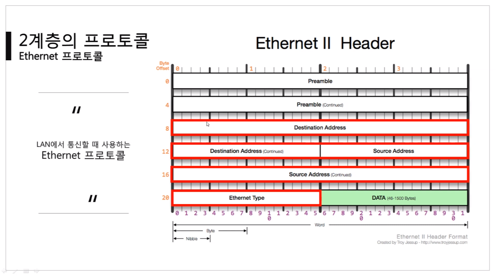
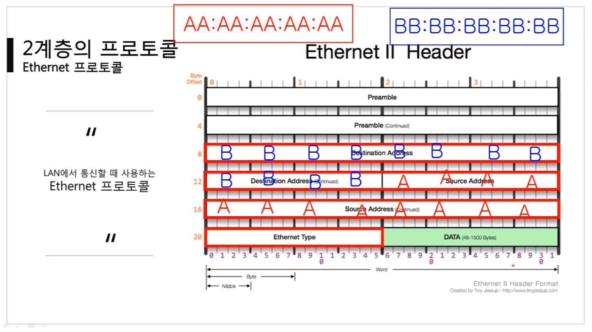
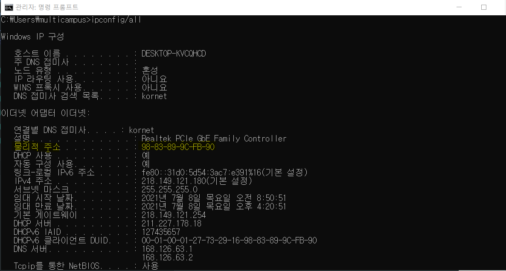
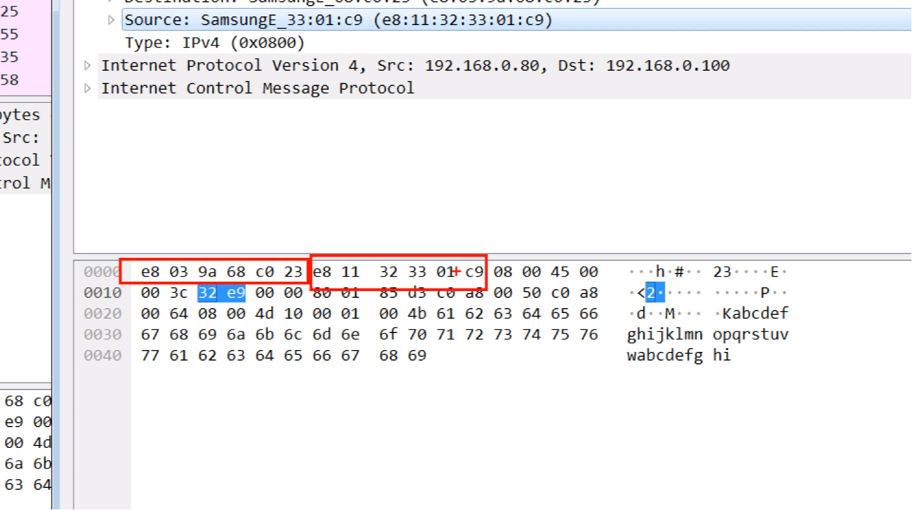

영상: [[따라學 IT] 03. 가까이 있는 컴퓨터끼리는 이렇게 데이터를 주고받는다](https://youtu.be/HkiOygWMARs?list=PL0d8NnikouEWcF1jJueLdjRIC4HsUlULi)

## 2계층에서 하는일

### 2게층의 기능

- 2계층은 `하나의 네트워크 대역`(LAN 대역), 즉 `같은 네트워크 상`에 존재하는 여러 장비들 중에서 어떤 장비가 어떤 장비에게 보내는 데이터를 전달
- 추가적으로 `오류제어`, `흐름제어`

### 2계층의 네트워크 크기

- 2계층은 `하나의 네트워크 대역 LAN`에서만 통신할 때 사용한다.
- 다른 네트워크와 통신할 때는 항상 `3계층`이 도와줘야한다.
- 3계층의 주소와 3계층의 프로토콜을 이용해야만 다른 네트워크와 통신이 가능하다.

## 2계층에서 사용하는 주소

### 물리적인 주소

- MAC 주소 : LAN에서 통신할 때 사용하는 물리적인 주소
  - ex. 6C-29-95-04-EB-A1
  - 16진수를 사용, 2개씩 묶어 12개의 16진수로 구성
  - `-`나 `:`로 구분한다.
  - OUI : IEEE에서 부여하는 일종의 제조회사 식별 ID(`6C-29-95`, 앞 6자리)
  - 고유번호 : 제조사에서 부여한 고유번호(`04-EB-A1`, 뒤 6자리)

### 2계층(Ethernet) 프로토콜

- Ethernet 프로토콜 : LAN에서 통신할 때 사용하는 프로토콜
  
  - Preamble : 신경쓰지 않아도 됨.
  - Destination Address : 6byte(16진수 2개당 1byte), `목적지`의 MAC 주소가 들어간다.
  - Source Address : 6byte(16진수 2개당 1byte), `출발지`의 MAC 주소가 들어간다.
  - DATA : 페이로드
    
  - Ethernet Type : Data(프로토콜) 안에 상위 계층의 어떤 프로토콜이 있다고 알려줌.
    - 왜? 받는 쪽 입장에서 페이로드를 까볼 때 상위계층의 프로토콜이 뭔지 알아야한다.
    - 이더넷에만 있는 형식이 아니고, 다른 프로토콜에서도 이런 역할을 하는 부분이 있다.

## 실습

### 1. 내 MAC주소 확인

### 2. 이더넷 통신 확인

- 목적지(6byte), 도착지(6byte), 이더넷타입(나머지 2byte)
