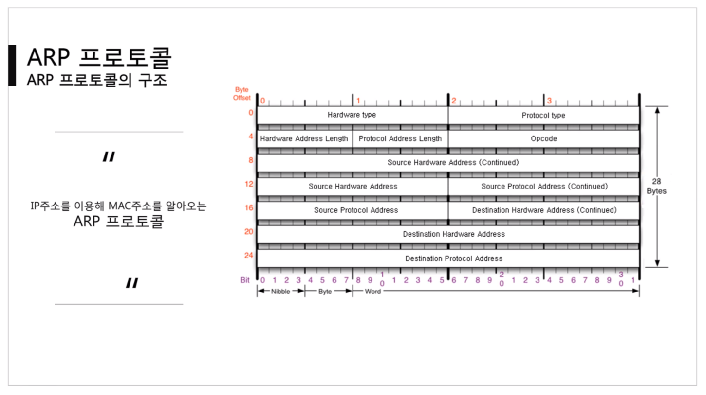
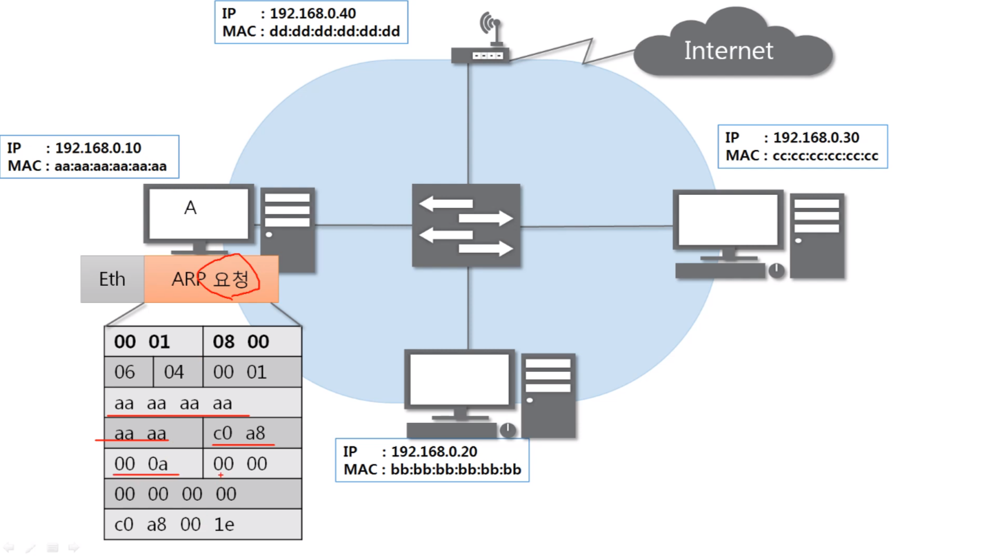
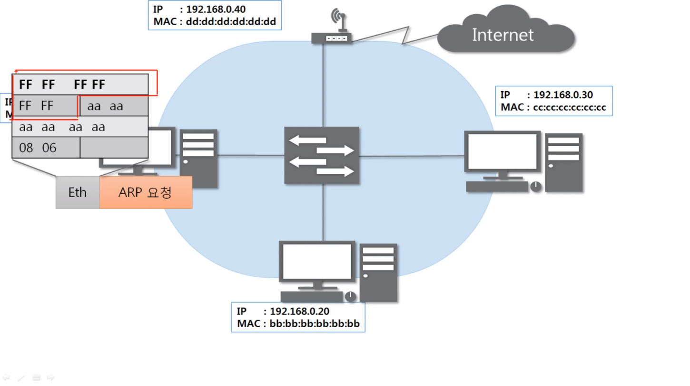
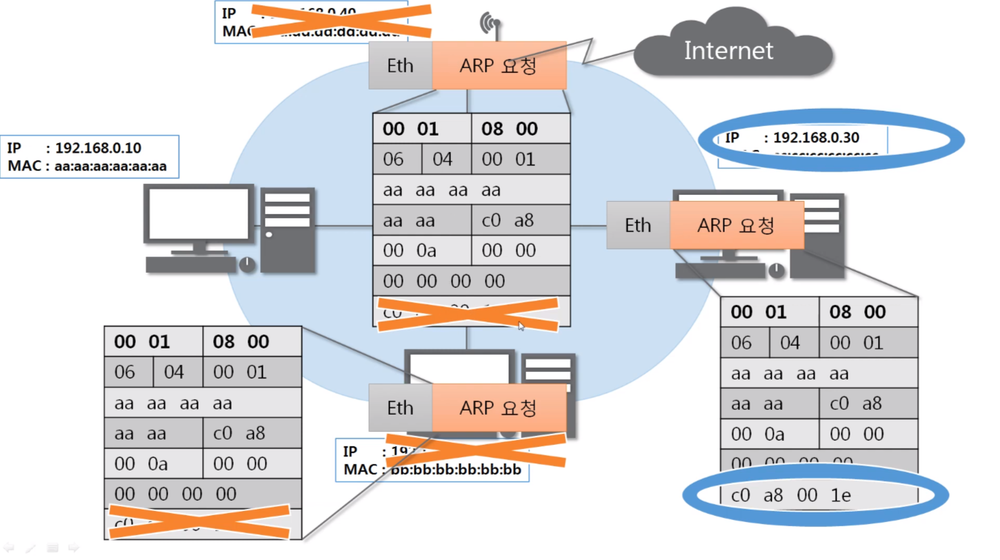
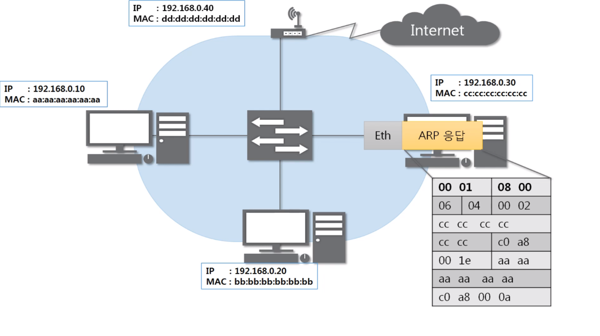

## [ARP 프로토콜](https://youtu.be/LDsp-Xb168E?list=PL0d8NnikouEWcF1jJueLdjRIC4HsUlULi)

### ARP가 하는 일

- ARP 프로로토콜은 같은 네트워크 대역에서 통신을 하기 위해 필요한 MAC주소를 IP주소를 이용해서 알아오는 프로토콜이다.
- 같은 네트워크 대역에서 통신을 한다고 하더라도 데이터를 보내기 위해서는 7계층부터 캡슐화를 통해 데이터를 보내기 때문에 IP주소와 MAC주소가 모두 필요하다.
- 이때 IP주소는 알고 MAC 주소는 모르더라도 ARP를 통해 통신이 가능하다.
- 보안상에도 중요하다.
- 3계층인데 같은 네트워크 대역에서만 쓰인다.
- MAC주소를 몰라서 브로드캐스팅 하기 때문

### ARP 프로토콜의 구조(28바이트)



- Hardware type : 2계층에서 사용하는 Protocol의 타입, 이더넷(0001), 4바이트, 16진수
- Protocol type : IPv4 Protocol type(0800), 4바이트, 16진수
- Hardward Address Length : MAC주소의 길이, 6바이트이므로 (06)
- Protocol Address Length : IPv4주소의 길이, 4바이트이므로 (04)
- Opcode(Operation Code) : 2가지가 있다. 2바이트, 16진수
  - 요청 : 0001
  - 응답 : 0002
- Source HardWare Address : 출발지의 MAC주소 6바이트
- Source Protocol Address : 출발지의 IPv4 주소 4바이트
- Destination HardWare Address : 목적지의 MAC주소 6바이트
- Destination Protocol Address : 목적지의 IPv4 주소 4바이트

- TIP ) 이더넷 프로토콜만 목적지가 먼저오고 나머지는 출발지가 먼저온다.

## ARP 프로토콜의 통신 과정

### IP주소로 MAC주소를 알아오는 과정

- A pc와 C pc가 있고, ip주소만 알고있다.
- A pc가 C pc에게 ARP 요청을 보낸다.(3계층)
  - 목적지 MAC주소 모르는데..?
  - 모르니까 `00 00 00 00 00 00`으로 비워둔다.
    
- Ethernet 프로토콜 encapsulation
  - 목적지 MAC주소 모르니까 `FF FF FF FF FF FF`로 채운다. (1로 꽉 채운다 => 브로드캐스트)
    
  - 이 프로토콜을 작성해서 같은 네트워크 대역의 모두한테 보낸다. (C가 어딨는지 모르니까)
- 2계층 장비(스위치)에서 2계층 프로토콜을 확인한다.(디캡슐레이션)
  - 목적지 주소가 브로드캐스트니까 같은 네트워크 대역의 모두에게 보낸다.
- 받은 모두는 디캡슐레이션을 한다.
  - 3계층 ARP 프로토콜을 열어본다.
  - 본인의 IP주소와 목적지 IP주소가 일치하지 않는 애들은 패킷을 버린다.
    
  - 일치하는 애들은 ARP 응답 프로토콜을 만든다. (Opcode : 0002 / 출발지 MAC주소에 자기 것을 넣는다.)
    
- 보낸다.
- 2계층 장비(스위치)에서 2계층 프로토콜을 확인한다.(디캡슐레이션) => A pc에 전달한다.
- A는 프로토콜을 디캡슐레이션해서 C의 MAC주소를 확인하고, `ARP 캐시 테이블`이라는 곳에 C의 MAC주소를 저장한다.
- 이 다음부터 통신이 이루어진다.(이 과정은 빨리 이뤄진다.)

## ARP 테이블

### 나와 통신했던 컴퓨터들

- 통신 했던 컴퓨터들의 주소는 ARP 테이블에 (일정시간 동안)남는다.
- 수동으로 등록하면 영구적으로 남을 수 있다.

## [ARP 프로토콜 실습](https://youtu.be/-M_S50Ga384?list=PL0d8NnikouEWcF1jJueLdjRIC4HsUlULi)

### ARP 테이블 확인해보기

- 명령어로 확인

```cmd
arp -a
```

### frame의 최소단위

- 최소단위 : 60바이트
  - padding (최소크기는 60바이트인데, 남으면 0을 채워준다.)
    - ARP가 28바이트, 이더넷이 14바이트니까 18바이트가 0으로 채워진다.
- 최대단위 : 1514바이트
