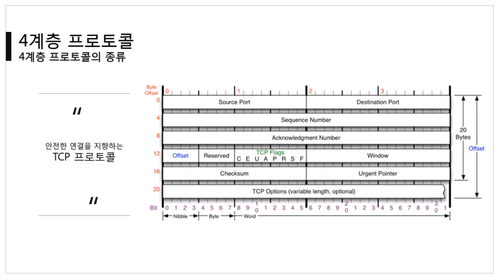

# 4계층 - 컴퓨터의 프로그램끼리는 이렇게 데이터를 주고 받는다.

- 2계층 : 가까운 컴퓨터끼리
- 3계층 : 다른 네트워크 대역까지

## [4계층 프로토콜](https://youtu.be/tG0ldt4sBzY?list=PL0d8NnikouEWcF1jJueLdjRIC4HsUlULi)

### 4계층에서 하는 일

- 전송 계층(Transport Layer)은 송신자의 `프로세스`와 수신자의 `프로세스`를 `연결하는 통신 서비스`를 제공한다.
  - 프로세스 : 디스크에 저장되어있던 프로그램이 메모리에서 동작 중인 것.(ex.실행되고 있는 카카오톡)
- 전송 계층은 연결 지향 데이터 스트림 지원, 신뢰성, 흐름 제어 그리고 다중화와 같은 편리한 서비스를 제공한다.
- 전송 프로토콜 중 가장 잘 알려진 것은 연결 지향 전송 방식을 사용하는 `전송 제어 프로토콜(TCP)`이다. 보다 단순한 전송에 사용되는 `사용자 데이터그램 프로토콜(UDP)`도 있다.

### 4계층 프로토콜의 종류

- 안전한 연결을 지향하는 `TCP 프로토콜`
  
- 안전한 연결을 지향하지 않는 `UDP 프로토콜`
  

## 포트 번호

### 포트 번호의 특징

- 특정 프로세스와 특정 프로세스가 통신을 하기 위해 사용한다.
- `하나의 포트는 하나의 프로세스만` 사용 가능하다.
- 하나의 프로세스가 여러 개의 포트를 사용하는 것은 가능하다.
- 상대방의 프로세스 여러 개는 내 포트 하나에 연결 가능하다.
- 포트 번호는 일반적으로 정해져 있지만 `무조건 지켜야 하는 것은 아니다.`
- 예를 들어 일반적으로 웹 서비스는 80번 포트를 사용하지만 웹 서비스가 항상 80번 포트를 사용해야만 하는 것은 아니다.

### Well-Known 포트

- 세계적으로 잘 알려진 서비스
  | 서비스 이름 | 포트 번호 |
  | ----------- | ---------- |
  | FTP | 20번,21번 |
  | SSH | 22번 |
  | TELNET | 23번 |
  | DNS | 53번 |
  | DHCP | 67번, 68번 |
  | TFTP | 69번 |
  | HTTP | 80번 |
  | HTTPS | 443번 |

### Registered 포트

- 조금 유명한 서비스
  | 서비스 이름 | 포트 번호 |
  | ---------------- | --------- |
  | 오라클 DB 서버 | 1521번 |
  | MySQL 서버 | 3306번 |
  | MS 원격 데스크탑 | 3389번 |

### Dynamic 포트

- 일반 사용자들이 사용하는 `Dynamic 포트`
  | 시작 포트 번호 | 마지막 포트 번호 |
  | -------------- | ---------------- |
  | 49152번 | 65535번 |

## 프로그램의 연결 정보

### 나와 현재 연결되어 있는 컴퓨터들

- `활성 연결 테이블` : 현재 포트 활성여부를 나타낸다
- 명령어 : `netstat -ano`
