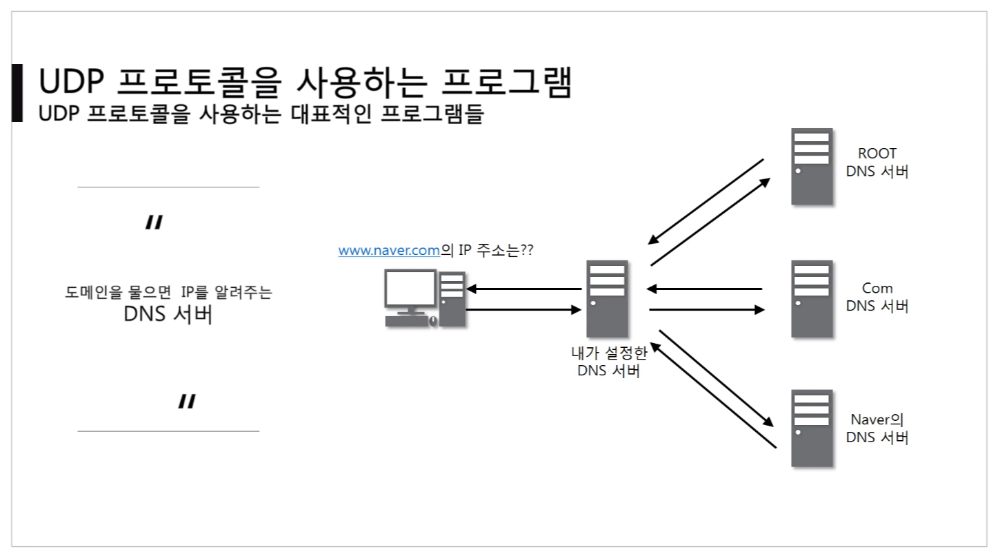

# 비연결지향형 UDP 프로토콜

## [UDP 프로토콜](https://youtu.be/3MkI3FBFzX8?list=PL0d8NnikouEWcF1jJueLdjRIC4HsUlULi)

### UDP가 하는일

- 사용자 데이터그램 프로토콜(User Datagram Protocol, UDP)은 유니버설 데이터그램 프로토콜(Universal Datagram Protocol)이라고 일컫기도 한다.
- UDP의 `전송 방식은 너무 단순`해서 서비스의 `신뢰성이 낮고`, 데이터 그램 도착 순서가 바뀌거나, 중복되거나, 심지어는 통보 없이 누락시키기도 한다.
- UDP 는 일방적으로 `오류의 검사와 수정이 필요 없는` 프로그램에서 수행할 것으로 가정한다.
- 데이터 전송에 문제가 생기면 검증이나 재전송 요청을 할 수 없다.

### UDP 프로토콜의 구조

- Source Port : 출발지 포트 번호(2바이트)
- Destination Port : 목적지 포트 번호(2바이트)
- Length : UDP 프로토콜 헤더 + 페이로드의 길이
- Checksum : 프로토콜이 잘못된게 있나 없나 체크

## UDP 프로토콜을 사용하는 프로그램

### UDP 프로토콜을 사용하는 대표적인 프로그램들

- 도메인을 물으면 IP를 알려주는 `DNS 서버`
  - IP주소를 알려줄 때, UDP 프로토콜을 사용한다.
    
- UDP로 파일을 공유하는 `tftp 서버`(파일 전송 프로그램)
- 라우팅 정보를 공유하는 `RIP 프로토콜`

## [tftpd로 파일 전송 실습](https://youtu.be/5Woau-EJChw?list=PL0d8NnikouEWcF1jJueLdjRIC4HsUlULi)

### 파일 전송을 UDP로 하면 좋을까?

- 중간에 데이터가 깨지면 안좋을 수 있다.
- 큰 파일은 UDP로 전송하지 않는다.
- UDP는 특수한 경우의 전송에서만 사용한다. (UDP/TCP 혼용)
  - ex.동영상 스트리밍 서비스
