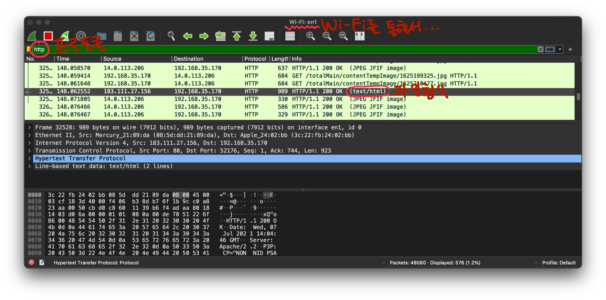
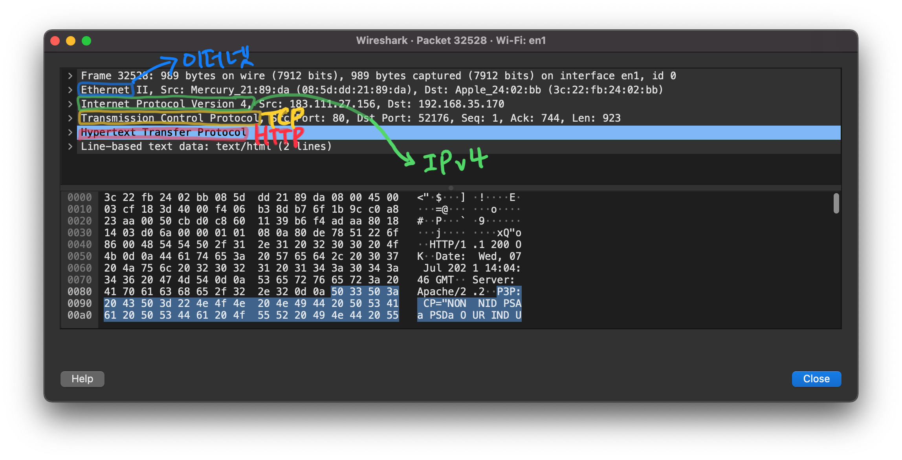
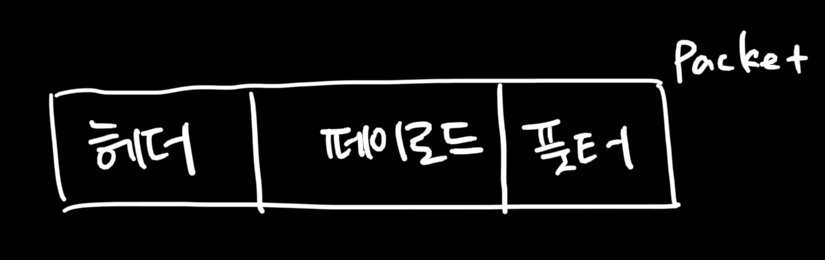
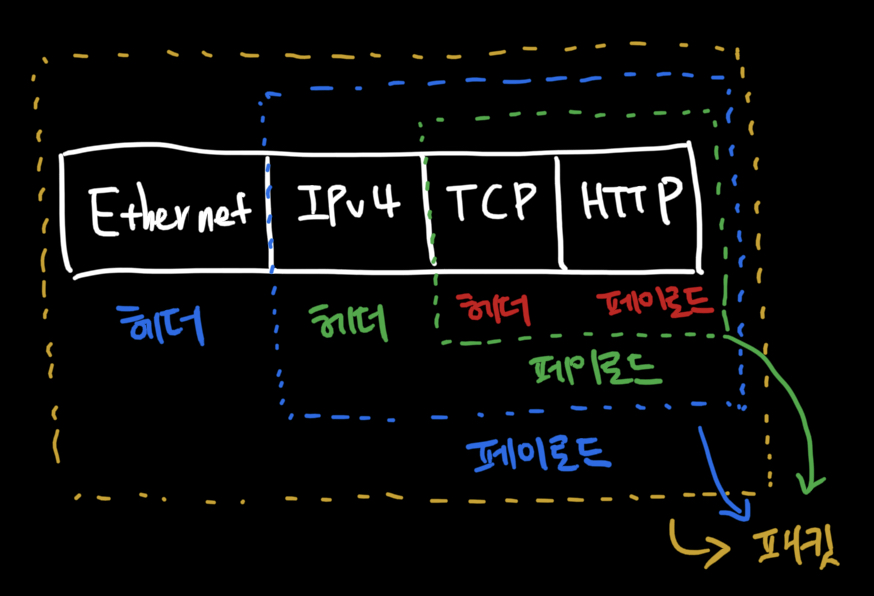
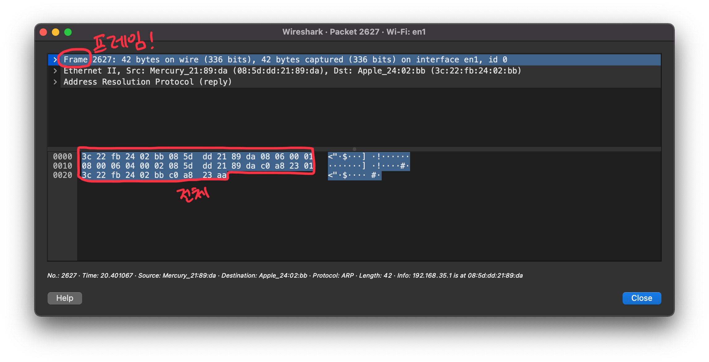
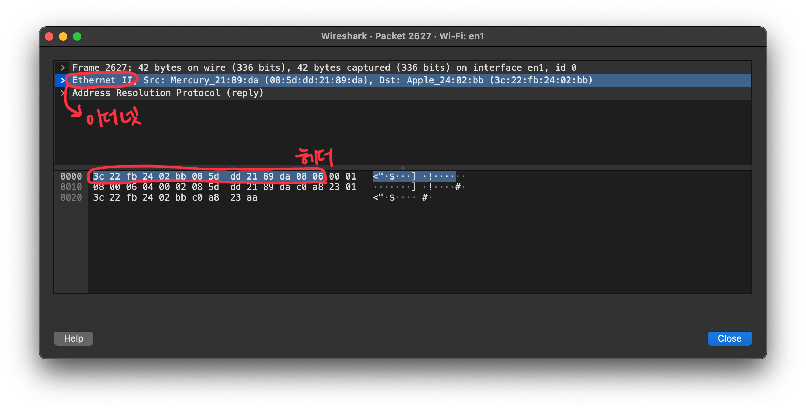
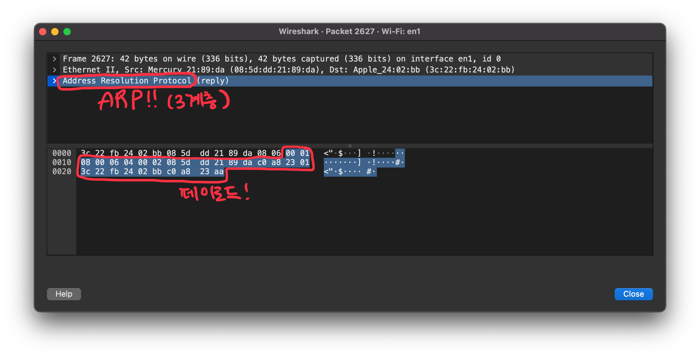

전체영상: [네트워크 기초(개정판)](https://www.youtube.com/playlist?list=PL0d8NnikouEWcF1jJueLdjRIC4HsUlULi)

### [네트워크란?](https://youtu.be/Av9UFzl_wis?list=PL0d8NnikouEWcF1jJueLdjRIC4HsUlULi)

- **노드**들이 데이터를 공유할 수 있게 하는 디지털 전기**통신망**의 하나이다.
- **인터넷**이란?
  - 여러가지 데이터를 **공유**하도록 구성된 전세계를 연결하는 **네트워크**
  - **www**는 인터넷을 통해 웹과 관련된 데이터를 공유하는 것...! (인터넷과 다름)
- 네트워크의 분류
  - 크기에 따른 분류
    - **LAN**: Local Area Netwrok
    - **WAN**: Wide Area Network, 멀리 있는 지역을 한데 묶은 네트워크
  - 연결 형태에 따른 분류
    - Star
    - Mesh
    - 혼합형: 실제 인터넷은 여러 형태를 혼합한 형태입니다.
- 네트워크의 통신방식
  - 유니캐스트
  - 멀티캐스트: 특정 다수와 1:N으로 통신
  - 브로드캐스트: 네트워크에 있는 모든 대상과 통신
- 네트워크 프로토콜
  - 일종의 약속, 양식
  - 노드와 노드가 통신할 때 **어떤 노드**가 **어떤 노드에게** **어떤 데이터**를 **어떻게 ** 보내는지 작성하기 위한 양식
  - 여러가지 프로토콜
    - 가까운 곳과 연락할 때 (MAC 주소)
      - Ethernet 프로토콜
    - 멀리 있는 곳과 연락할 때 (IP 주소)
      - ICMP
      - IPv4
      - ARP
    - 여러가지 프로그램으로 연락할 때 (포트 번호)
      - TCP
      - UDP
- 패킷
  - 여러 프로토콜들로 캡슐화 된 것

### [실습1 (tracert [traceroute in Mac OS])](https://youtu.be/paJf7JbBWqY?list=PL0d8NnikouEWcF1jJueLdjRIC4HsUlULi)

- tracert 명령어를 이용하여 컴퓨터가 어떻게 통신하는지 간단히 살펴보는 실습입니다.
- 저의 경우 **MAC**으로 실습을 진행해서 명령어가 윈도우랑 다릅니다.
- 아래 그림은 terminal에서 `traceroute`를 실행한 결과입니다.
  
- 크게 봤을 때 **총 9개의 네트워크를 지나서 구글 서버에 접속**합니다.

### [실습2 (Wireshark)](https://youtu.be/vBrQ3yzerMg?list=PL0d8NnikouEWcF1jJueLdjRIC4HsUlULi)

- **Wireshark** is the world's foremost and widely-used network protocol analyer.
- Wireshark 설치하고 실행 (Mac OS의 경우 **ChmodBPF.pkg**도 설치해주세요. -> permission 이슈 때문에...)
  - ChmodBPF.pkg는 Wireshark 설치후 실행하면 알아서 alert 됩니다.
- 아래 그림은 와이파이를 통해 왔다갔다하는 패킷들을 보여줍니다. (주소창에 www.danawa.com을 입력했습니다.)
  
- 아래 그림은 위에 표시된 패킷을 더블클릭하여 상세보기를 한 것입니다.
  
- 이더넷 -> IPv4 -> TCP -> HTTP 
- **패킷**은 위에서 **여러 프로토콜을 캡슐화 한 것** 이라고 했는데 wireshark를 활용하여 눈으로 확인했습니다.

### [네트워크 모델](https://youtu.be/y9nlT52SAcg?list=PL0d8NnikouEWcF1jJueLdjRIC4HsUlULi)

- TCP/IP 모델

- OSI 7 계층: 데이터를 주고받을 때 데이터 자체의 흐름을 각 구간별로 나눠 놓은 것

  - 우리가 알아야 할 프로토콜
    - 7계층: HTTP
    - 4계층: TCP, UDP
    - 3계층: IP, ARP
    - 2계층: 이더넷

#### TCP/IP 모델과 OSI 비교

  - 공통점: 계층적 네트워크 모델, 계층간 역할 정의
  - 차이점: 계층 수, OSI는 역할기반 & TCP/IP는 프로토콜 기반, OSI는 통신 전반에 대한 표준 & TCP/IP는 데이터 전송기술 특화
#### 패킷

- 패킷은 제어 정보와 사용자 데이터로 이루어지며 사용자 데이터는 페이로드라고도 한다.
  
  - 헤더:
  - 페이로드: 데이터
  - 풋터: 일반적으로 잘 사용하지 않는다.
  - 패킷은 아래와 같이 다양한 내부 구성을 가질 수 있습니다.
    
    - 위 사진은 여러 프로토콜을 이용해서 최종적으로 보내진 패킷의 모양이라고 생각하면 됩니다. (**캡슐화**)
    - 프로토콜을 붙일때 상위계층이 가장 안쪽에 붙습니다. (위 사진은 7계층이 가장 안쪽)
  - Decapsulation
    - 패킷을 받았을 때 프로토콜들을 하나씩 확인하면서 데이터를 확인하는 과정
    - 이더넷 확인 -> IPv4 확인 -> TCP 확인 -> HTTP(데이터) 확인
  - PDU: Protocol Data Unit
    - 4계층 PDU: 세그먼트
    - 3계층 PDU: 패킷 (**인터넷을 통해 왔다갔다 하는 일반적으로 불리는 패킷과 다름**, 이름만 같습니다.)
    - 2계층 PDU: 프레임

#### 실습

Wireshark를 활용하여 패킷의 구조를 조금 더 자세하게 살펴봅시다. (위의 내용을 충분히 이해했다면 아래 그림은 쉽게 이해가 됩니다.)

