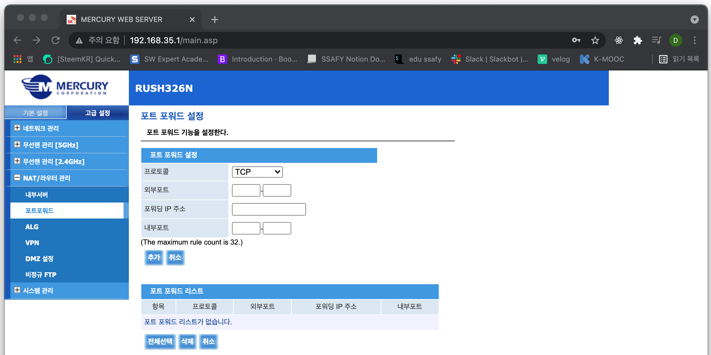

### [NAT란?](https://youtu.be/Qle5cfCcuEY?list=PL0d8NnikouEWcF1jJueLdjRIC4HsUlULi)

- **Network Address Translation**
- IP 패킷의 TCP/UDP 포트 숫자와 소스 및 목적지의 IP 주소 등을 **재기록**하면서 라우터를 통해 네트워크 트래픽을 주고 받는 기술
- 패킷에 변화가 생기기 때문에 IP나 TCP/UDP의 **체크섬도 다시 계산되어 재기록**해야 한다.
- NAT를 이용하는 이유는 **같은 네트워크 상 여러개의 호스트가 하나의 공인 IP 주소를 사용하여 인터넷에 접속**하기 위함입니다.
- 하지만 꼭 사설 IP를 공인 IP로 변환하는 데에만 사용하는 기술은 아닙니다.

### 포트 포워딩

- 패킷이 라우터나 방화벽과 같은 네트워크 장비를 가로지르는 동안 **특정 IP 주소와 포트 번호의 통신 요청을 특정 다른 IP와 포트 번호로 넘겨주는** 네트워크 주소 변환(**NAT**)의 응용이다.
- 이 기법은 **사설 네트워크에 상주하는 호스트에 대한 서비스를 생성하기 위해** 흔히 사용된다.
- 공인 IP로 패킷이 들어왔을 때 **특정 포트로 들어온 요청**이라면 특정 **IP의 특정 포트**로 전송합니다.

### [포트 포워딩 설정 실습](https://youtu.be/EvYI14QdM6A?list=PL0d8NnikouEWcF1jJueLdjRIC4HsUlULi)

1. 포트포워딩 설정해보기 (실습 강의 청강만 하고 따라 하지는 않았습니다.)
   
   - **외부포트 번호는 가진 패킷**이 공인 IP 주소로 오게되면, **해당 패킷을 포워딩 IP 값을 가지는 장비로 보내**게 됩니다.
2. 사설 IP를 사용하는 서버로 접속해보기

