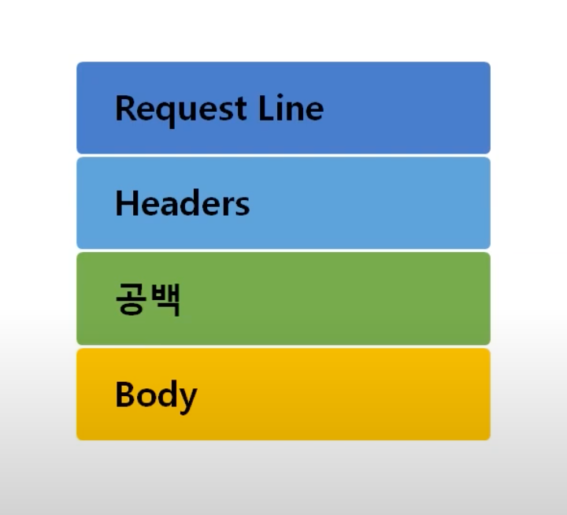
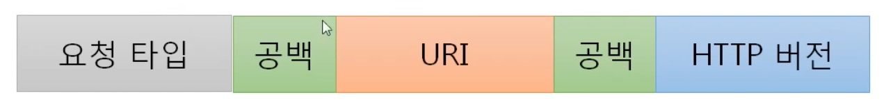

### [HTTP 프로토콜](https://youtu.be/TwsQX1AnWJU?list=PL0d8NnikouEWcF1jJueLdjRIC4HsUlULi)

- **Hyper Text Transfer Protocol**

#### 웹을 만드는 기술들

- **HTML, Javascript, CSS 등의 파일**을 **서버로부터 받아오는 프로토콜**
- HTTPS -> 보안이 추가되었습니다.
- **ASP/ASP.NET**, **JSP**, **PHP** -> **서버 쪽**에서 활용하는 것들
- DB

#### HTTP 프로토콜의 특징

- www에서 쓰이는 핵심 프로토콜
- 문서의 전송을 위해 쓰이며, 오늘날 거의 모든 웹 application에서 사용되고 있습니다.
- 음성, 화상 등 여러 종류의 데이터를 MIME로 정의하여 전송 가능
  - MIME: Multipurpose Internet Mail Extensions
    - 전자우편의 데이터 형식을 정의한 표준 포맷
    - 여러 **멀티미디어 데이터**들의 바이너리 데이터를 **ASCII 코드로 변환하는 방법**과 미디어 종류를 **MIME 타입 목록으로 정의**하였습니다.
- Request / Response 동작에 기반하여 서비스 제공
- HTTP 1.0의 특징
  - **단순함**
  - **네트워크 부하가 심합**니다. (매번 3Way Handshake...)
- HTTP 1.1 
  - 처음에 3Way Handshake를 진행합니다.
  - 이후에 **모든 요청 응답을 처리**하고 **연결을 종료**합니다.
  - 1.0을 개선했습니다.

### [HTTP 요청 프로토콜](https://youtu.be/rxaBwwI_JnI?list=PL0d8NnikouEWcF1jJueLdjRIC4HsUlULi)

- HTTP Method 설명 중 **GET, POST**만 사용해야 한다고 하지만 개발자 입장에서 **RESTful API** 개발시 **PUT, DELETE도** 사용하는게 원칙임
- 요청 프로토콜 구조
  - 아래 그림과 같이 생겼습니다.
    
  - Request Line 구조
    
  - **GET, POST, PUT, DELETE** 중요 (HTTP 메소드)
- GET과 POST 방식의 차이
  - GET은 **url**에 -> **중요한 정보가 아닌**경우
  - POST는 **body**에 -> 중요한 정보의 경우 (**body**에 데이터를 추가하기 때문에 **다른 사람이 볼 수 없**다.)

### [URL, URI란?](https://youtu.be/2ikhZ_fNP5Y?list=PL0d8NnikouEWcF1jJueLdjRIC4HsUlULi)

- **URI**: 인터넷 상에서 **특정 자원(파일)**을 나타내는 **유일한 주소**
  - `scheme://host[:port][/path][?query]`
    - `scheme`: 7계층 프로토콜을 작성한다고 생각하면 됩니다.
    - `host[:port]`: ip 주소와 port 번호를 직접쓰기 보다는 **도메인 주소**를 작성합니다.
      - 특히 port 번호는 웹 브라우저가 알아서 처리 해줍니다. (80 혹은 443)
    - `/path`: 파일 경로

### [HTTP 요청 프로토콜 작성 실습](https://youtu.be/XbGJYsxed2w?list=PL0d8NnikouEWcF1jJueLdjRIC4HsUlULi)

- 

### [URI 이해를 위한 실습](https://youtu.be/HBojczyd1Ac?list=PL0d8NnikouEWcF1jJueLdjRIC4HsUlULi)

- 

### [HTTP 응답 프로토콜](https://youtu.be/kuucNF4Zvbs?list=PL0d8NnikouEWcF1jJueLdjRIC4HsUlULi)

- 

### [HTTP 헤더 포맷](https://youtu.be/mQTGmxendk8?list=PL0d8NnikouEWcF1jJueLdjRIC4HsUlULi)

- 

### [HTTP 프로토콜 분석 실습](https://youtu.be/dhMrKTwNI8U?list=PL0d8NnikouEWcF1jJueLdjRIC4HsUlULi)

-