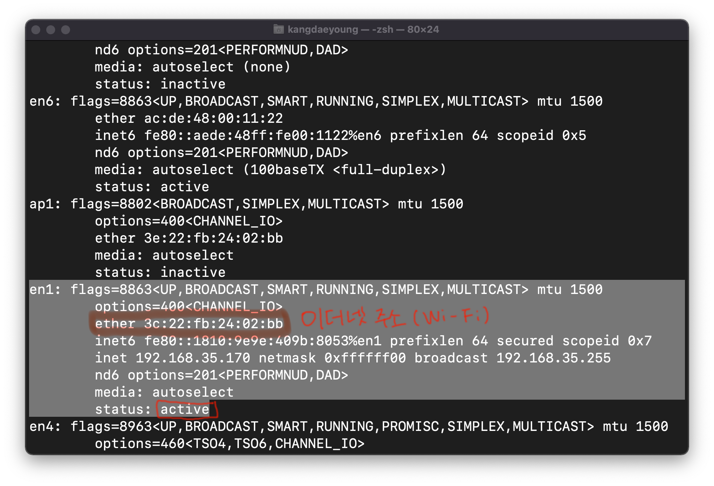
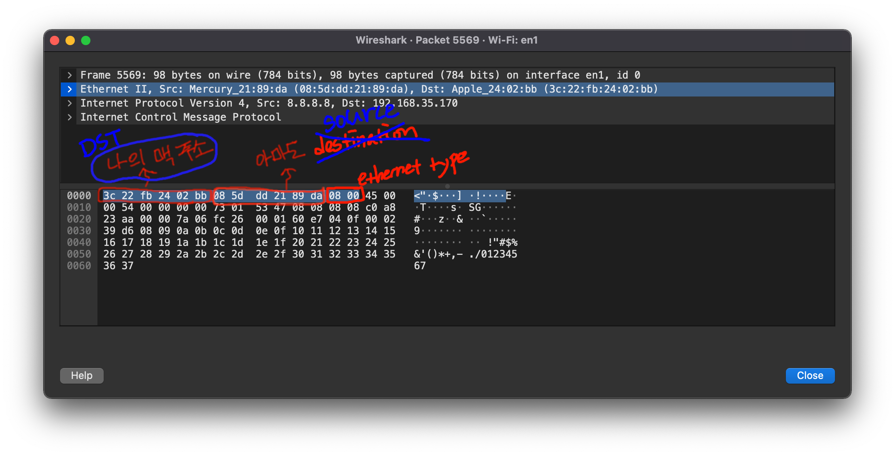

영상: [[따라學IT] 03. 가까이 있는 컴퓨터끼리는 이렇게 데이터를 주고받는다](https://youtu.be/HkiOygWMARs?list=PL0d8NnikouEWcF1jJueLdjRIC4HsUlULi)

### 2계층에서 하는일

- 2계층은 **같은 네트워크 상(LAN)**에 존재하는 여러 장비들 중에서 **어떤 장비**가 **어떤 장비**에게 보내는 데이터를 전달
- 추가적으로 오류제어, 흐름제어 수행
  - 오류제어: 데이터 오류 체크
  - 흐름제어: 누구로부터 누구에게 가는지 제어
- 다른 네트워크(다른 LAN)와 통신할 때는 항상 **3계층**이 도와주어야 한다.

### 2계층에서 사용하는 주소

- LAN에서 통신할 때 사용하는 **MAC** 주소 -> OUI와 고유번호로 이루어져있습니다.
  - OUI: IEEE에서 부여하는 일종의 제조회사 식별 ID
  - 고유번호: 제조사에서 부여한 고유번호

### 2계층(Ethernet) 프로토콜

- Destination Address(목적지): 6 byte
- Source Address(보내는 사람): 6 byte
- Ethernet Type: 2 byte
  - 상위 계층의 프로토콜을 의미합니다.
- 즉 총 14 byte

### 실습

1. MAC 주소 찾기
  - `ifconfig`를 terminal에 입력시 아래와 같은 결과를 볼 수 있습니다. (Mac OS)

  - 아래 그림에서 이더넷 주소 -> MAC 주소로 이해해주세요. ~~(오타입니다 ㅜ)~~

  

2. Wireshark를 이용하여 패킷 분석

   - 아래 그림은 패킷의 헤더를 분석한 것입니다.

   - 응답 패킷을 열었기 때문에 Destination이 저의 맥주소 값을 가지고 있습니다.

     

