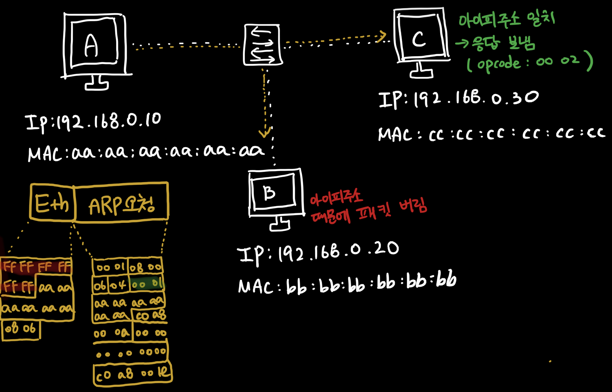
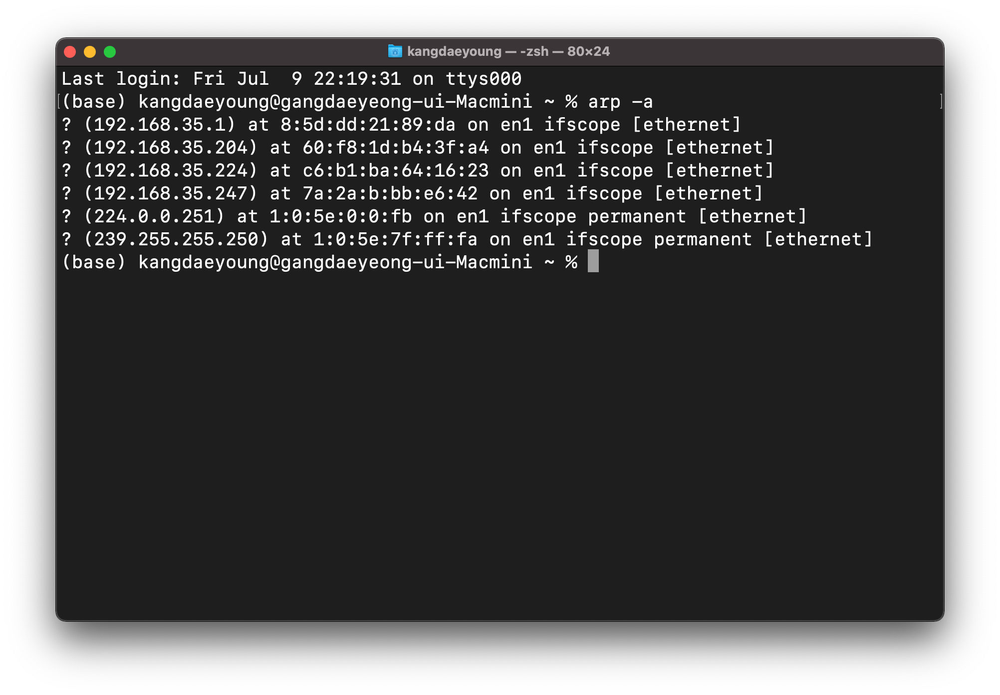
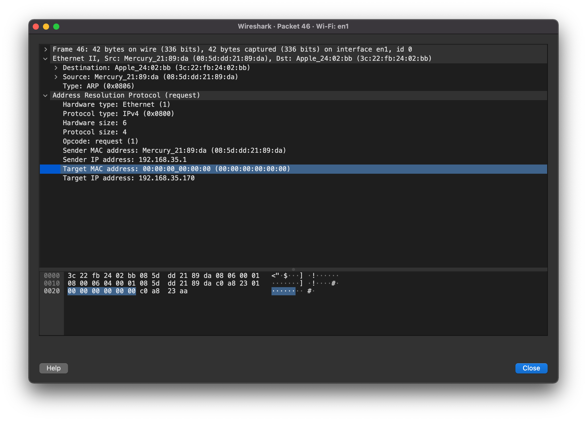
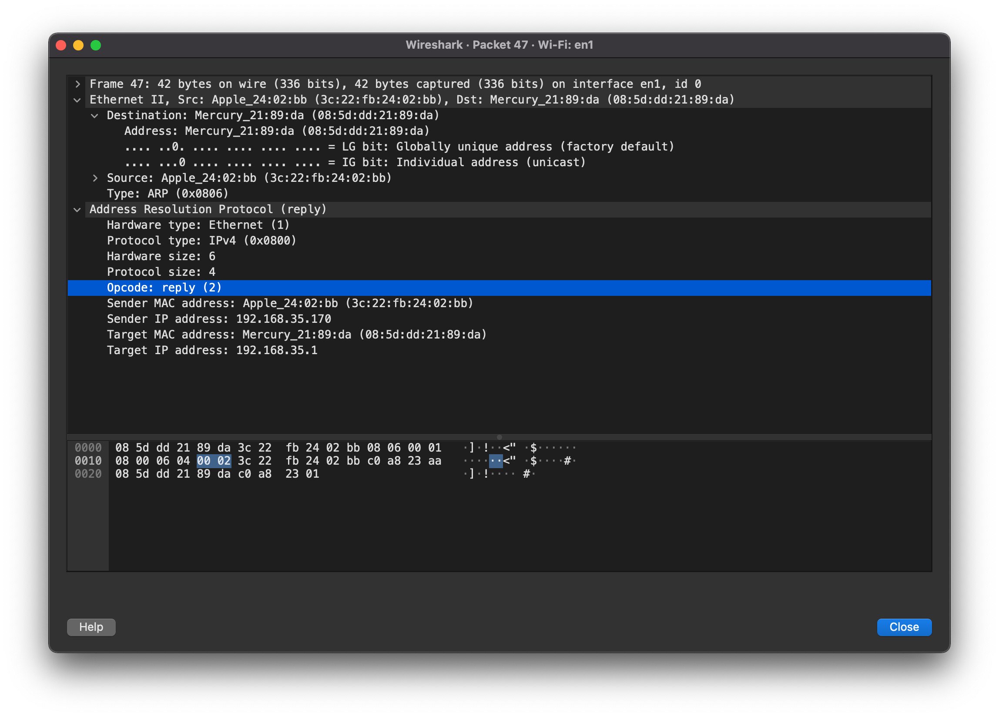

### [ARP 프로토콜](https://youtu.be/LDsp-Xb168E?list=PL0d8NnikouEWcF1jJueLdjRIC4HsUlULi)

- **같은 네트워크 대역**에서 통신을 하기 위해 필요한 **MAC 주소**를 **IP 주소를 이용해서 알아오는 프로토콜**이다.
- 같은 네트워크 대역에서 통신을 한다고 하더라도 데이터를 보내기 위해서는 7계층부터 캡슐화를 통해 데이터를 보냅니다.
- **따라서 IP & MAC 주소 모두 필요합니다.**
- 이 때 **IP 주소는 알고 MAC 주소는 모르더**라도 **ARP를 통해 통신이 가능**합니다.
- 24 byte로 구성
  - Hardware Type: 2 byte, 2계층 프로토콜 (대게 Ethernet Protocol)
  - Protocol Type: 2 byte, 거의 모든 경우에 IPv4 를 의미하는 '0800'이 담겨있습니다.
  - Hardware Address Length: 1byte, MAC 주소 길이 (06)
  - Protocol Address Length: 1byte, IP 주소 길이 (04)
  - Opcode(Operation Code를 의미): 2 byte, 요청(1)인지 혹은 응답(2)인지를 알려줍니다.
  - Source Hardware Address: 6 byte, 출발지 MAC 주소
  - Source Protocol Address: 4 byte, 출발지 IP 주소
  - Destination Hardware Address: 6 byte, 도착지 MAC 주소
  - Destination Protocol Address: 4 byte, 도착지 IP 주소
  - **Ethernet 프로토콜만** **도착지**가 먼저 적혀있고, **나머지**는 **출발지**가 먼저 적혀있습니다.

### ARP 프로토콜의 통신 과정

1. **ARP 최초 요청시 IP 주소만 알고있다**.
2. 따라서 MAC 주소를 모르기에 **FF:FF:FF:FF:FF:FF** (멀티캐스트, LAN에서만...)로 설정합니다.
3. **멀티캐스트**라 **같은 네크워크(LAN)상**의 모든 컴퓨터가 해당 패킷을 받습니다.
4. 해당 패킷을 decaosulation하고 자신의 IP와 대조합니다.
5. **자신의 IP와 다르다면** 해당 패킷은 **버립니다.**
6. **자신의 IP와 같다면** Opcode를 수정합니다. 또한 프로토콜도 알맞게 수정합니다. (**ARP 응답**)

### ARP 캐시 테이블

(캐시는 **영구적 저장이 아니라 일정 시간이 지나면 삭제**한다는 의미를 가지고 있습니다.)

- ARP 캐시 테이블 확인을 위한 명령어:  `arp -a` (Mac OS terminal)
- 결과 사진
  

### [ARP 프로토콜 실습](https://youtu.be/-M_S50Ga384?list=PL0d8NnikouEWcF1jJueLdjRIC4HsUlULi)

- ARP request
  
- ARP response
  

