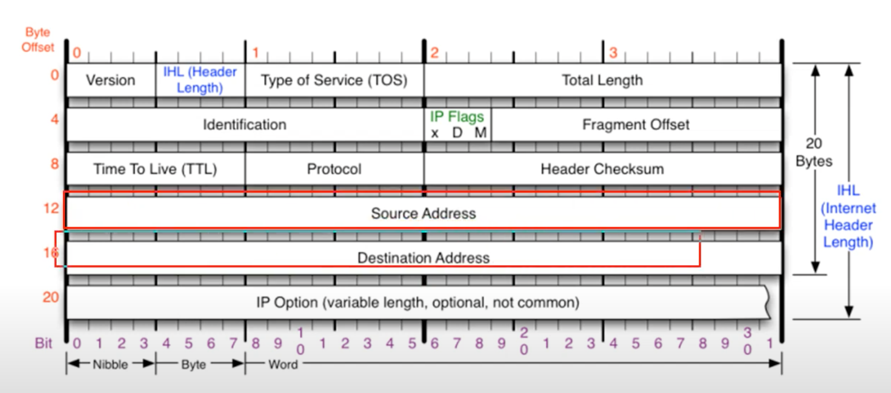
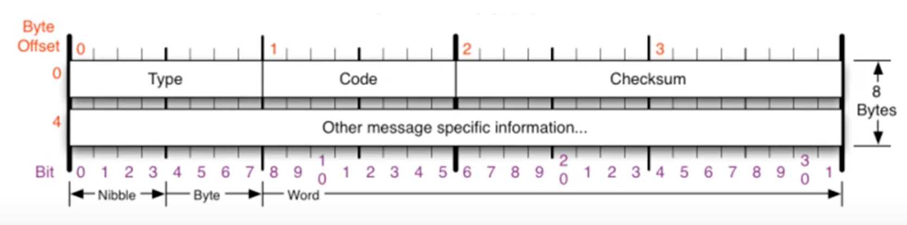
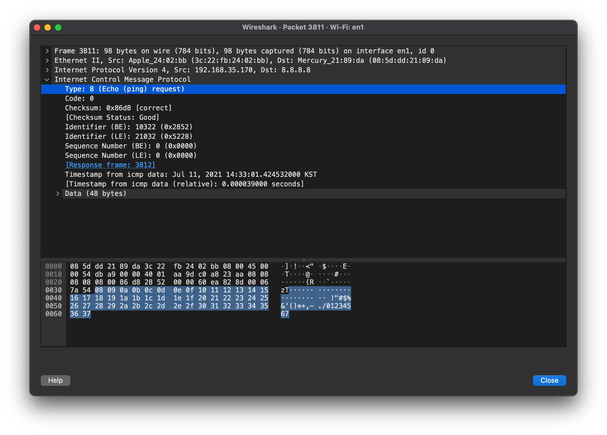
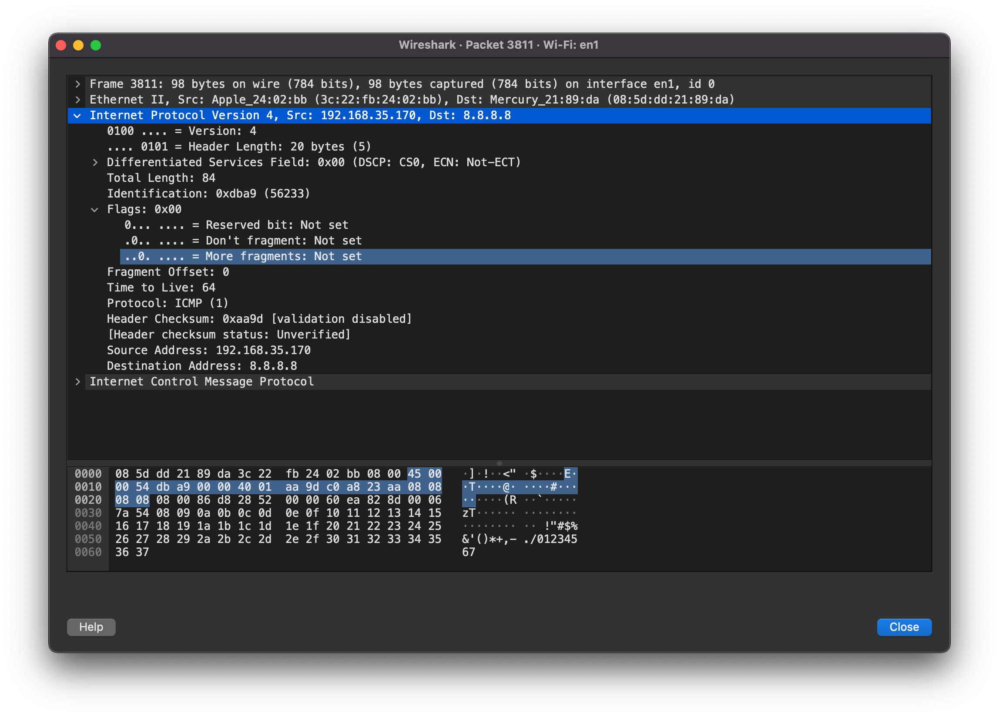
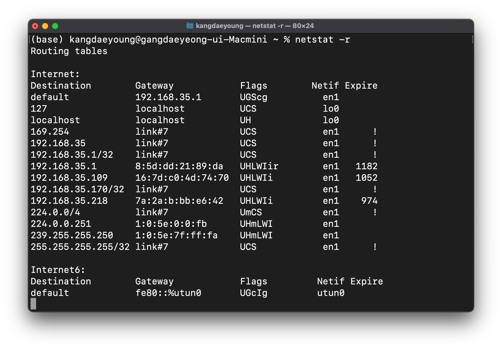
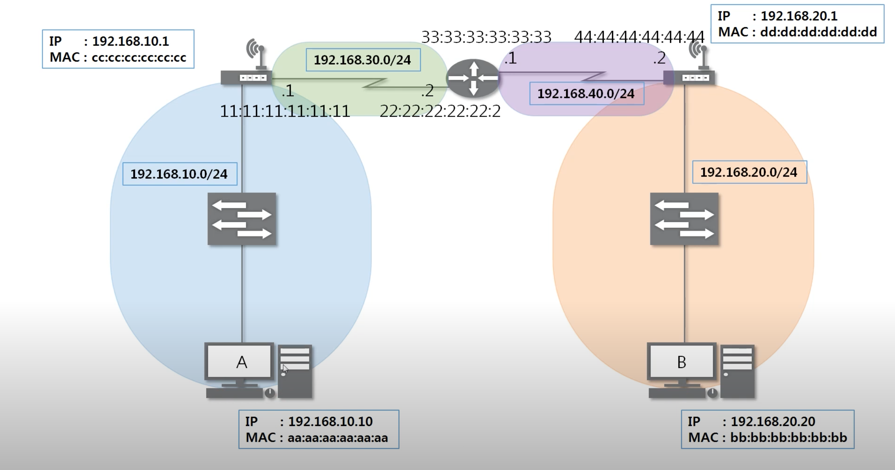

### [IPv4 프로토콜](https://youtu.be/_i8O_o2ozlE?list=PL0d8NnikouEWcF1jJueLdjRIC4HsUlULi)

- 네트워크 상에서 데이터를 교환하기 위한 프로토콜
- 데이터가 **정확하게 전달될 것을 보장하지 않는다.**
- **중복된 패킷**을 전달하거나 **패킷의 순서를 잘못 전달**할 가능성도 있다. (악의적 이용시 DoS 공격)
- 데이터의 **정확하고 순차적인 전달**은 **TCP**에서 보장한다.
- **다른 네트워크의 특정 대상을 찾는 IPv4 프로토콜**
- IPv4 프로토콜 구조
  
  - Version: 4 bit
  - IHL (Header Length): 4 bit, 프로토콜의 길이 (20 byte ~ 60 byte)를 표현한다. 
    - if 20 byte -> '0 1 0 1'
    - if 25 byte -> '0 1 1 0'
    - if 60 byte -> '1 1 1 1'
  - TOS (Type of Service): 1 byte, 옛날에 사용했고, 현재는 사용하지 않는다.
  - Total Length: 2 byte, 페이로드를 포함한 전체 길이
  - Identification: 2 byte, 어떤 **데이터를 쪼개서 보낸다면** 해당 데이터에 속하는 애들은 모두 **같은 Identification 값**을 가진다.
  - IP Flags (x D M): 3 bit
    - x: 첫번째 비트이고 사용하지 않습니다.
    - D: **최대 전송 단위의 설정을 바꿀때 사용**합니다. 하지만 최대 전송 단위를 변경하면 데이터가 아예 전송되지 않을 수 있습니다. 따라서 잘 사용하지 않습니다.
    - M: 데이터를 조각화해서 보냈을 때 패킷 뒤에 **다른 패킷이 더 있다고 명시**할 때 사용
  - Fragment Offset: 13 bit, **맨 앞을 기준으로 얼마만큼 떨어져 있는지 표현**합니다.
    - offset 의미: **어떤 것을 기준으로 얼마만큼 떨어져**있다.
  - Time To Live (TTL): 1 byte, 패킷이 라우터를 지날때마다 값이 1씩 줄어듭니다.
    - 윈도우는 128, 리눅스는 64를 초기값으로 가집니다.
  - Protocol: 1 byte, 상위 프로토콜이 무엇인지 알려줍니다.
  - Header Checksum: 2 byte, **헤더에 오류가 있는지 체크**하기 위해 존재

### [ICMP 프로토콜](https://youtu.be/JaBCIUsFE74?list=PL0d8NnikouEWcF1jJueLdjRIC4HsUlULi)

- Internet Control Message Protocol (인터넷 제어 메시지 프로토콜)
- 네트워크 컴퓨터 위에서 돌아가는 운영체제에서 **오류 메시지**를 전송 받는 데 주로 쓰인다.
- 특정 대상과 내가 **통신이 잘되는지 확인**한다.
- ICMP 프로토콜 구조
  
  - Type: 대분류
    - 0, Echo Reply, **응답**
    - 8, Echo, **요청**
    - 3, Destination Unreachable, 가는 **경로상에 문제**
    - 11, Time Exceded, **상대방에 문제**가 있는 경우 (방화벽 등)
    - 5, Redirect, **라우팅 테이블을 수정**할때 사용했습니다.
  - Code: 소분류

### [IPv4, ICMP프로토콜 실습](https://youtu.be/8ZwTvTuZlVw?list=PL0d8NnikouEWcF1jJueLdjRIC4HsUlULi)

- 패킷에서 ICMP 부분 살펴보기
  
  - 8 byte를 제외하고 나머지는 **쓸 데없는 데이터**입니다.
- 패킷에서 IPv4 살펴보기
  
  - 위에 작성된 이론의 내용이랑 비교하면 좋을 것 같습니다. ~~(별로 어렵지 않아요.)~~

### [라우팅 테이블](https://youtu.be/CjnKNIyREHA?list=PL0d8NnikouEWcF1jJueLdjRIC4HsUlULi)

- 라우팅 테이블 보기위한 명령어: `netstat -r` (아래는 결과 사진입니다.)
  
- **라우팅 테이블에 적힌 네트워크만 찾아갈 수 있습니다.**
- **0.0.0.0** (default)로 설정되었다면 **다른 네트워크 대역**이므로 **게이트웨이**로 가게 됩니다.

#### 다른 네트워크와 통신하는 과정

- A 컴퓨터의 라우팅 테이블에 B의 IP 주소가 있어야지만 통신이 가능합니다.
- **없다면 ARP**를 수행해야 합니다.

### [IPv4 조각화 이론](https://youtu.be/_AONcID7Sc8?list=PL0d8NnikouEWcF1jJueLdjRIC4HsUlULi)

- 큰 IP 패킷들이 적은 **MTU** (Maximum Transmission Unit)를 갖는 링크를 통하여 전송되려면 **여러 개의 작은 패킷으로 조각화 되어 전송**돼야 합니다.
- 일단 조각화되면, 최종 목적지에 도달할 때까지 재조립되지 않는 것이 일반적입니다.
- IPv4에서는 발신지 뿐만 아니라 **중간 라우터에서도 IP 조각화** 가능
- IP v6에서는 IP 단편화가 발신지에서만 가능
- **재조립**은 항상 최종 수신지에서만 가능합니다.

### [IPv4 조각화 실습](https://youtu.be/QKEL9aBgHtg?list=PL0d8NnikouEWcF1jJueLdjRIC4HsUlULi)

- Q1
  - 보내려는 **데이터 크기**: 2379
  - **MTU**: 980
  - Question
    - 몇 개의 패킷으로 쪼개지는가? 
      - 3개
    - 첫번째 패킷의 데이터 크기는?
      - 960
    - 마지막 패킷의 데이터 크기는?
      - 459
- Q2
  - 보내려는 데이터 크기: 4618
  - MTU: 1370
  - Question
    - 몇 개의 패킷으로 쪼개지는가?
      - 4개
    - 첫번째 패킷의 데이터 크기는?
      - 1350
    - 마지막 패킷의 데이터 크기는?
      - 568

- Wireshark 실습
  - 보내려는 데이터 크기: 4800
  - MTU: 1500