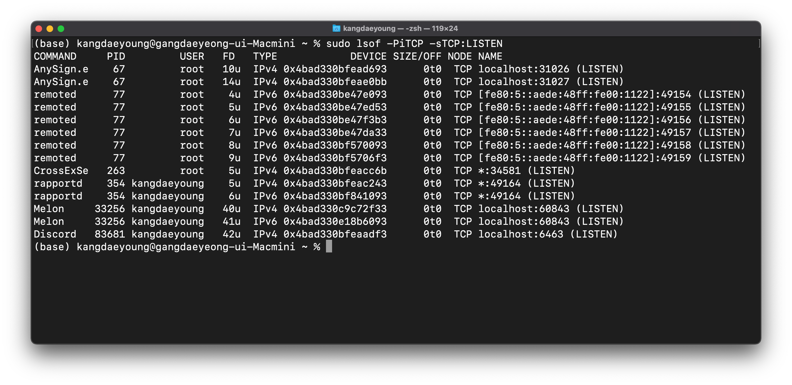

### [4계층 프로토콜](https://youtu.be/tG0ldt4sBzY?list=PL0d8NnikouEWcF1jJueLdjRIC4HsUlULi)

- 전송 계층(Transport layer)은 **송신자의 프로세스**와 **수신자의 프로세스**를 **연결하는 통신 서비스**를 제공한다.
- 전송계층은 **연결 지향 데이터 스트림 지원**, **신뢰성**, **흐름 제어**, **다중화**와 같은 편리한 서비스를 제공한다.
  - 연결 지향 전송 방식을 사용하는 **전송 제어 프로토콜 (TCP)**
  - 보다 단순한 전송에 사용되는 **사용자 데이터그램 프로토콜 (UDP)** - 비연결 지향

### 포트 번호

- 특정 프로세스와 특정 프로세스가 통신을 하기 위해 사용

- **하나의 포트는 하나의 프로세스만** 사용 가능합니다.

- 하나의 프로세스가 여러 개의 포트를 사용하는 것은 가능합니다.

- 포트 번호는 일반적으로 정해져 있지만 **무조건 지켜야 하는 것은 아닙니다.**

- **Well-Known 포트**

  | 서비스 이름 | 포트번호 |
  | :---------: | :------: |
  |     FTP     |  20, 21  |
  |SSH|22|
  |TELNET|23|
  |DNS|53|
  |DHCP|67|
  |TFTP|69|
  |HTTP|80|
  |HTTPS|443|
  
- **조금은 유명한 Registered 포트**

  |   서비스 이름    | 포트 번호 |
  | :--------------: | :-------: |
  |  오라클 DB 서버  |   1521    |
  |    MySQL 서버    |   3306    |
  | MS 원격 데스크탑 |   3389    |

- 일반 사용자들이 사용하는 **Dynamic 포트 번호**: **49152번 ~ 65535번**

### [포트 연결 확인 실습](https://youtu.be/Jb7tCFp-udM?list=PL0d8NnikouEWcF1jJueLdjRIC4HsUlULi)

- `sudo lsof -PiTCP -sTCP:LISTEN`
  

### [특정 포트 사용 실습](https://youtu.be/Qqmwm3rFihk?list=PL0d8NnikouEWcF1jJueLdjRIC4HsUlULi)

- 포트번호를 바꾸는 실습입니다.
- 딱히 할 필요가 없는거 같아서 실습은 진행하지 않았습니다.
- www.naver.com.:443
- **443**: https 포트 번호

