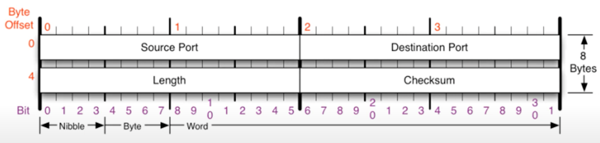

### [UDP 프로토콜](https://youtu.be/3MkI3FBFzX8?list=PL0d8NnikouEWcF1jJueLdjRIC4HsUlULi)

- **비연결 지향형**
- 사용자 데이터그램 프로토콜(User Datagram protocol, UDP)은 유니버설 데이터그램 프로톨(Universal Datagram Protocol)이라고도 불린다.
- UDP **전송 방식은 매우 단순**합니다.
  - 따라서 **신뢰성이 낮습니다.**
  - 데이터그램 도착 순서가 바뀌거나, 중복되거나, 통보 없이 누락시키기도 합니다.
- UDP는 일반적으로 **오류의 검사와 수정이 필요 없는** 프로그램에서 수행할 것으로 가정한다.
- UDP 프로토콜의 구조는 아래와 같습니다.
  
- Length: 헤더 + 페이로드
- UDP 프로토콜을 사용하는 **프로그램**
  - DNS 서버
  - tftp(Trivial File Transfer Protocol) 서버
  - RIP 프로토콜

### [tftpd로 파일 전송 실습](https://youtu.be/5Woau-EJChw?list=PL0d8NnikouEWcF1jJueLdjRIC4HsUlULi)

- 파일 전송에 쓰는게 좋을까?
  - **큰 용량의 파일을 전송할 때**는 **사용하지 않습**니다.
  - **스트리밍 서비스**에서 사용하기도합니다.
    - 60프레임 중 59 프레임만 전송 받았다고 해도 사람이 볼 때 큰 **차이를 느끼기 힘들기 때문**입니다.