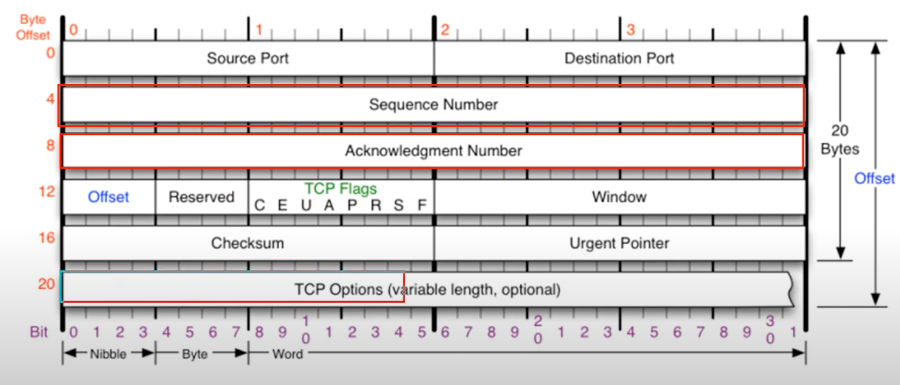
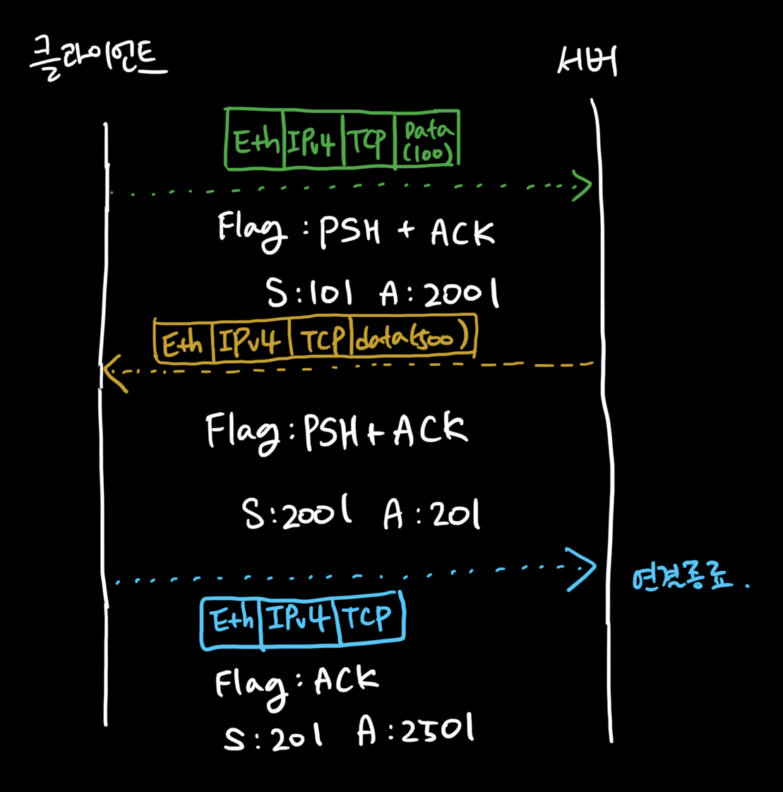

### [TCP 프로토콜](https://youtu.be/cOK_f9_k_O0?list=PL0d8NnikouEWcF1jJueLdjRIC4HsUlULi)

- **전송 제어 프로토콜(Transmission Control Protocol, TCP)**은 인터넷에 연결된 컴퓨터에서 실행되는 프로그램 간에 **안정적으로, 순서대로, 에러없이** 통신할 수 있게 합니다.
- TCP는 UDP보다 안전하지만 느립니다.
- 프로토콜 구조
  
  - Offset: 헤더의 길이 (ip와 동일한 방법으로 기입, 4로 나누어서)
  - TCP Options: 4 byte 씩 붙고 최대 10개까지 (40 byte) 붙을 수 있다.

### TCP 플래그

- C, E, U, A, P, R, S, F
- **U**: urgent 급한 데이터 의미
  - Urgent Pointer: 어디 부터 긴급인지 표시한다.
- **A**: acknowledge로 통신 승인을 의미합니다.
- **P**: push
- **R**: reset으로 연결관계를 초기화 한다는 의미입니다.
- **S**: sync라는 의미로 연결을 시작할 때 무조건 사용합니다.
  - 해당 플래그 이후로 두 프로그램은 **지속적으로 동기화**합니다.
- **F**: finish를 의미하며, 연결을 종료할 때 사용합니다.

### [TCP 3Way Handshake](https://youtu.be/Ah4-MWISel8?list=PL0d8NnikouEWcF1jJueLdjRIC4HsUlULi)

#### TCP를 이용한 통신과정 (연결 수립 과정)

- TCP를 이용한 데이터 통신을 할 때 프로세스와 프로세스를 연결하기 위해 **가장 먼저 수행되는 과정**
  1. **클라이언트가 서버**에게 요청 패킷 전송 (Flag: SYN)
  2. **서버가 클라이언트**의 요청을 받아들이는 패킷 전송 (Flag: SYN + ACK)
  3. **클라이언트**는 이를 **최종적으로 수락**하는 패킷 전송 (Flag: ACK)
- **위 3개의 과정을 3Way Handshake**라 부릅니다.
- 페이로드 없습니다.

### [TCP를 이용한 데이터 전송 과정](https://youtu.be/0vBR666GZ5o?list=PL0d8NnikouEWcF1jJueLdjRIC4HsUlULi)

- **페이로드를 포함**한 패킷을 주고 받을 때의 TCP 규칙

  1. 보낸 쪽에서 또 보낼 때는 **SEQ & ACK 번호가 그대로**다.
  2. 받는 쪽에서 **SEQ 번호**는 **받은 ACK 번호**가 된다.
  3. 받는 쪽에서 **ACK 번호**는 **받은 SEQ 번호 + 데이터 크기**

- 아래 그림은 위 과정의 예시를 보여줍니다.

  

### [TCP의 연결 상태 변화](https://youtu.be/yY0uQf0BTH8?list=PL0d8NnikouEWcF1jJueLdjRIC4HsUlULi)

- **TCP 상태전이도**
- TCP의 여러가지 상태 변화
  - **ESTABLISHED**: 3Ways Handshake 가 끝난 후
- 예시
  - 클라이언트가 서버에게 최초로 패킷을 보낼때 (3Way-Handshake 중 처음) -> **SYN_SENT** 상태
  - 서버는 LISTENING 상태였기에 패킷을 받고 **SYN_RECEIVED** 상태
    - 서버는 다시 클라이언트에게 요청을 수락하는 패킷을 보낼 겁니다. (3Way-Handshake 중 두번 째)
  - 클라이언트가 최종적으로 수락하는 패킷을 서버에게 보낼 겁니다.
    - 이 때 클라이언트와 서버는 **ESTABLISHED** 상태가 됩니다.

### [TCP 프로토콜 분석 실습](https://youtu.be/WseqBDo-j3Y?list=PL0d8NnikouEWcF1jJueLdjRIC4HsUlULi)

- 아래 사진은 TCP flow graph를 보여줍니다. (WireShark)
  

