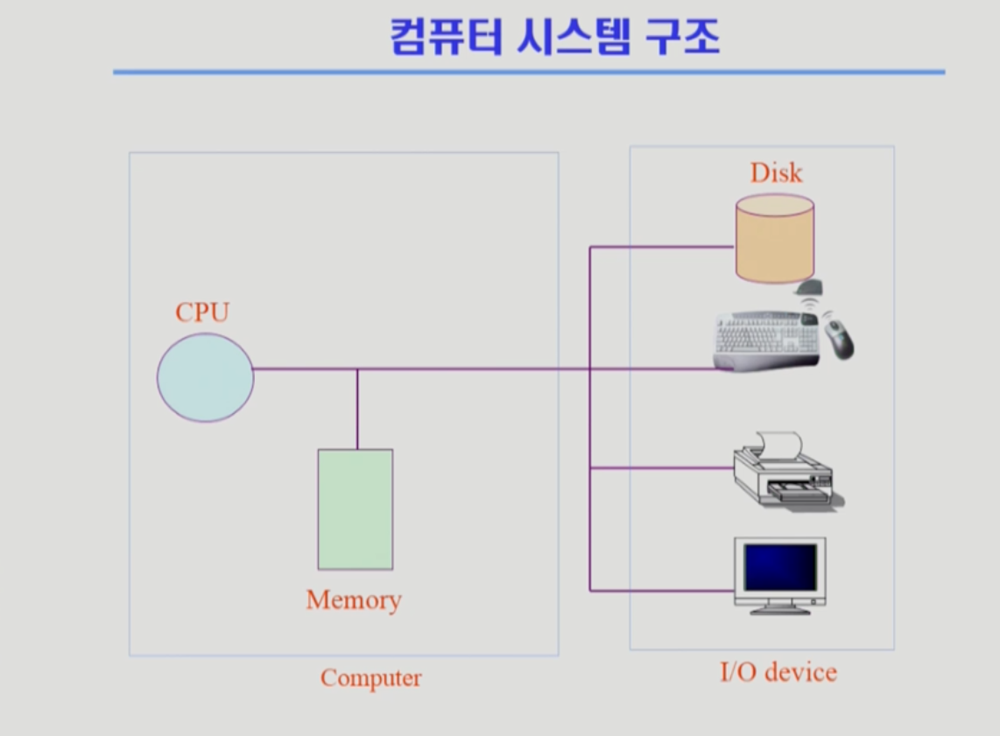

영상: [운영체제](http://www.kocw.net/home/search/kemView.do?kemId=1046323)

## [1 운영체제 개요](https://core.ewha.ac.kr/publicview/C0101020140307151724641842?vmode=f)

### 운영 체제란?

- Operating System, OS
- **하드웨어 바로 위**에 설치되어 **사용자 및 다른 모든 소프트웨어와 하드웨어를 연결하는 소프트웨어 계층**
- 좁은 의미의 운영체제(**커널**)
  - 운영체제의 핵심 부분으로 컴퓨터 부팅 순간부터 **메모리에 상주**하는 부분
- 넓은 의미의 운영체제
  - 커널을 포함한 **각종 주변 시스템 유틸리티를 포함**한 개념

### 운영 체체의 목적

- 컴퓨터 시스템의 **자원을 효율적으로 관리**
  - 사용자간의 **형평성** 있는 자원 분배
  - 주어진 자원으로 **최대한의 성능**을 내도록
- 하드웨어 관리 뿐만아니라 **소프트웨어 관리**도 합니다.
- 컴퓨터 시스템을 **편리하게 사용할 수 있는 환경**을 제공

### 운영 체제의 분류

- **동시 작업 가능 여부**
  - 단일 작업(single tasking)
    - 하나의 작업만 처리
  - 다중 작업(multi tasking)
    - 동시에 두 개 이상의 작업 처리
- **사용자 수**
  - 단일 사용자(single user)
  - 다중 사용자(multi user)
- **처리 방식**
  - 일괄 처리(batch processing)
    - 작업 요청의 **일정량을 모아서 처리**
  - 시분할(time sharing)
    - 여러 작업을 수행할 때 **일정한 시간 단위로 분할**
  - 실시간(Realtime OS)
    - **정해진 시간** 안에 어떠한 일이 **반드시 종료됨**이 보장되어야 하는 OS
    - ex) 원자로/공장 제어, 미사일 제어, 반도체 장비, 로보트 제어
    - 실시간 시스템의 개념 확장
      - Hard realtime system (경성 실시간 시스템): 데드라인을 무조건 지켜야 합니다.
      - Soft realtime system (연성 실시간 시스템): 데드라인에 대해 조금은 융통성이 있습니다.

### 몇 가지 용어

- **Multitasking**
  - 하나의 CPU가 프로그램을 돌아가면서 실행하는 경우를 말합니다.
- **Multiprogramming**
  - 여러 프로그램이 **메모리**에 올라가 있음을 강조
- **Time sharing**
  - CPU **시간을 분할**하여 나누어 쓴다는 의미를 강조
- **Multiprocess**
  - Multitasking과 유사한 용어입니다.
- &#10071;**Multiprocessor**
  - 하나의 컴퓨터에 **CPU (processor)가 여러개** 붙어 있음을 의미합니다.

### 운영 체제의 예

- UNIX
  - 코드의 대부분을 C언어로 작성
  - 높은 이식성
  - 최소한의 커널 구조
  - 복잡한 시스템에 맞게 확장 용이
  - 소스 코드 공개
  - 프로그램 개발에 용이
  - 다양한 버전 (Linux etc.)
- MS
  - DOS (Disk Operating System)
    - 단일 사용자용 운영체제
    - 메모리 관리 능력의 한계
  - MS Windows
    - 다중 작업용 GUI 기반 운영 체제
    - 네트워크 환경 강화

### 운영 체제의 구조

- 아래 그림은 운영체제의 구조를 보여줍니다. (강의 자료 스크린샷)
  
- 입출력 관리 (I/O device)
  - 인터럽트

## [2 시스템 구조 및 프로그램의 실행 Part-1](https://core.ewha.ac.kr/publicview/C0101020140311132925816476?vmode=f)

### 컴퓨터 시스템 구조

- 아래 그림과 같습니다.
  
- 자세한 컴퓨터 시스템 구조
  
  - **CPU**: Memory로 부터 인스트럭션을 읽으 들이고 해당 **인스트럭션을 실행**합니다.
    - registers
    - mode bit: 실행되고 있는 것이 무엇인지 나타냅니다.
    - interrupt line: device가 접근하는 라인입니다.
  - **device controller**: 해당 기기를 제어합니다.
  - **timer**: **무한 루프**에 빠지지 않게 하기 위함입니다. (각 프로세스에게 **정해진 시간동안**만 돌아가게 하는 역할을 수행하기도 합니다.)
  - Mode bit
    - 사용자 모드: 1
    - 모니터 모드(= 커널 모드, 시스템 모드): 0
      - 보안을 해칠 수 있는 **중요한 명령어**는 모니터 모드에서만 수행가능 => **특권명령**
      - **Interrupt나 Exception** 발생시 하드웨어가 mode bit을 **0**으로 바꿈
      - **사용자 프로그램**에게 CPU를 넘기기 전에 mode bit을 **1**로 세팅

### Device Controller

- 해당 **I/O 장치 유형을 관리**하는 작은 **CPU**
- **제어 정보**를 위해 **control register, status register**를 가집니다.
- **local buffer**를 가집니다. (일종의 **data register**)

### DMA (Direct Memory Access)

- I/O 장치가 **너무 많이 인터럽트**를 걸기 때문에 이를 방지하기 위함입니다.
- I/O 장치의 결과를 memory에 올리는 역할을 수행합니다. (CPU를 조금 더 효율적으로 쓰기 위해서...)

### Memory Controller

- DMA controller와 CPU를 **중재**합니다.
- **같은 데이터**에 접근하지 않기 위해서 중재합니다.

### [입출력과 인터럽트 (Input-Output and Interrupt)](컴퓨터-구조/5장-기본-컴퓨터의-구조와-설계-Part2/입출력과-인터럽트.md)

- **인터럽트**
  - 인터럽트 당한 시점의 **레지스터**와 program **counter**를 **save** 한 후, CPU 제어를 **인터럽트 처리 루틴**에 넘긴다.

- 인터럽트 **넓은 의미**
  - Interrupt: **하드웨어**가 발생시킨 인터럽트
  - Trap: **소프트웨어** 인터럽트
    - Exception: 프로그램이 오류를 범한 경우
    - System call: 프로그램이 커널 함수를 호출하는 경우
- 인터럽트 관련 용어
  - **인터럽트 벡터**
    - 해당 인터럽트의 처리 루틴 주소를 가지고 있음
  - **인터럽트 처리 루틴** (=Interrupt Service Routine, **인터럽트 핸들러**)
    - 해당 인터럽트를 처리하는 커널 함수

### 시스템 콜 (System Call)

- **사용자 프로그램**은 **운영체제**에게 I/O 요청
- **Trap**을 사용하여 **인터럽트 벡터**의 특정 위치로 이동
- 제어권이 인터럽트 벡터가 가리키는 **인터럽트 서비스 루틴**으로 이동
- 올바른 I/O 요청인지 확인 후 **I/O 수행**
- I/O 완료 시 제어권을 시스템 콜 **다음 명령**으로 옮김
- (**사용자 프로그램**이 처음 CPU에게 인터럽트를 걸고 I/O 처리가 끝난 후에는 **하드웨어**가 해당 요청이 끝났다고 CPU에게 인터럽트를 보냅니다. 즉 **소프트웨어 & 하드웨어** 모두 인터럽트를 보냅니다.)

## [2 시스템 구조 및 프로그램의 실행 Part-2](https://core.ewha.ac.kr/publicview/C0101020140314151238067290?vmode=f)

### 동기식 입출력과 비동기식 입출력

- synchronous I/O
  - I/O 요청 후 **입출력 작업이 완료된 후**에 **제어가 사용자 프로그램에** 넘어감
- asynchronous I/O
  - I/O가 시작된 후 입출력 작업이 끝나기를 기다리지 않고 **제어가 사용자 프로그램에 즉시 넘어감**

### DMA (Direct Memory Access)

- **CPU의 중재 없이** device controller가 device의 buffer storage의 내용을 메모리에 block 단위로 직접 전송

### 서로 다른 입출력 명령어

- I/O를 수행하는 special instruction에 의해
- Memory Mapped I/O에 의해
  - I/O 디바이스가 어드레스를 가지게 합니다. -> 메모리 접근처럼 I/O 디바이스에 접근합니다.

### 저장장치 계층 구조

- [12장 메모리 구조](컴퓨터-구조/12장-메모리-구조/12장-메모리-구조.md) 
- 저장장치 계층 구조는 아래와 같습니다.
  
  - 위쪽(Primary)으로 갈 수록 속도가 빠르고 가격이 비싸며 휘발성이 있습니다.
  - secondary 쪽은 보통 비 휘발성입니다.
  - Primary: CPU가 **바이트단위**로 접근 가능한 영역들입니다.
  - Secondary: **섹터단위**로 접근 가능합니다.

### 프로그램의 실행 (메모리 load)

- 아래 그림은 프로그램 실행의 과정을 보여줍니다.
  
  - **virtual memory**에 프로세스가 저장됩니다.
  - **Physical memory**에는 당장 쓰이는 부분만 저장됩니다. -> 메모리 낭비를 줄이기 위해
  - 당장 쓰이지 않는 부분은 **Swap area**에 저장됩니다.
    - Swap area는 **메모리 연장**을 목적으로 사용합니다. -> 전원이 꺼지면 데이터가 사라집니다.
  - **Address transition**
    - 같은 프로세스일지라도 virtual memory에 저장된 주소랑 physical memory에 저장된 주소랑 다릅니다.
    - 주소를 physical memory에 적절하게 바꿔주는 것을 Address transition이라고 합니다.

### 커널 주소 공간의 내용

- PCB: process control block
  - 운영체제가 프로세스를 관리하기 위한 **자료구조**

### 사용자 프로그램이 사용하는 함수

- 함수
  - 사용자 정의 함수
  - 라이브러리 함수
  - 커널 함수
    - 운영체제 프로그램의 함수
    - 커널 함수의 호출 -> 시스템 콜