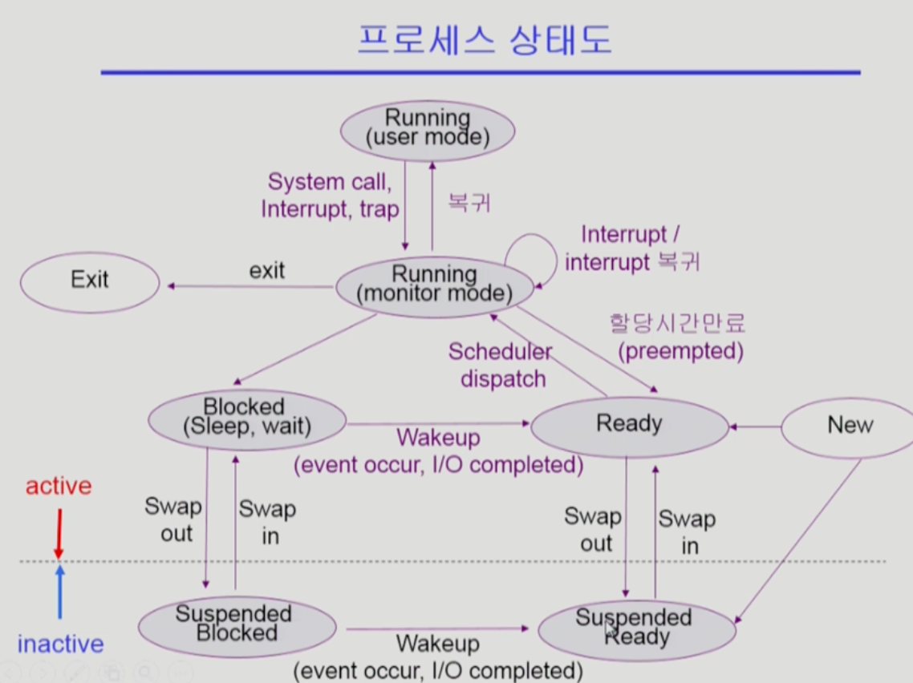
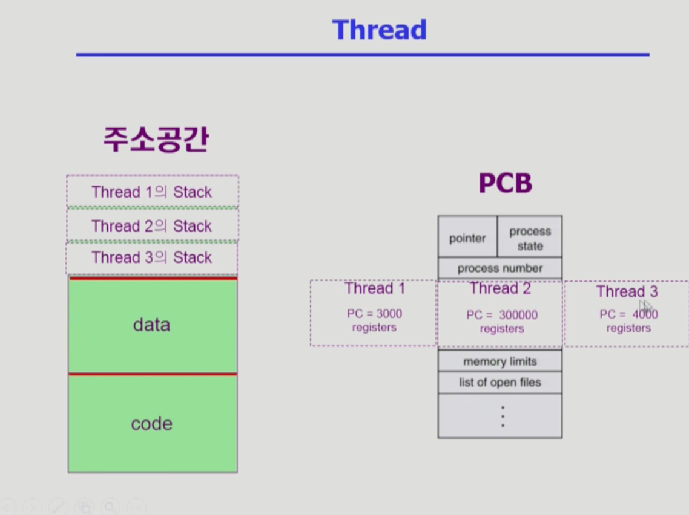

## [프로세스 #1](https://core.ewha.ac.kr/publicview/C0101020140318134023355997?vmode=f)

### 프로세스의 개념

- Process is **a program in execution**
- **프로세스의 문맥(context)**
  - **CPU 수행 상태**를 나타내는 하드웨어 문맥 (**CPU**와 관련)
    - Program counter
    - 각종 register
  - 프로세스의 주소 공간 (**메모리**와 관련)
    - code, data, stack
  - 프로세스 관련 커널 자료 구조
    - PCB (Process Control Block)
    - Kernal stack (시스템 콜하면 PC가 커널 주소공간을 가리킬 것입니다.)
- 프로세스의 문맥을 정확히 알아야 다른 프로그램을 실행하고, 다시 돌아와서 실행할 때 정확한 위치에서부터 다시 실행할 수 있습니다.

### 프로세스의  상태 (Process State)

- Running
  - **CPU를 잡고** instruction을 수행중인 상태
- **Ready**
  - **CPU를 기다리는** 상태 (디스크가 아니라 **메모리에 올려져 있는 상태**일 때)
- **Blocked (wait, sleep)**
  - **CPU를 주어도 당장 수행할 수 없는 상태**
  - Process 자신이 요청한 event가 즉시 만족되지 않아 이를 기다리는 상태
  - ex) 디스크에서 file을 읽어와야 하는 경우
  - **자신이 요청한 event가 만족되면 Ready** 
- **Suspended** (중기 스케줄러 때문에 생겼습니다.)
  - 외부적인 이유로 프로세스의 수행이 정지된 상태
  - 프로세스는 통째로 디스크에 swap out 된다.
  - ex) 사용자가 프로그램을 일시 정지시킨 경우 (break key)
  - 시스템이 여러 이유로 프로세스를 잠시 중단시킴 (메모리에 너무 많은 프로세스가 올라와 있을 때)
  - **외부에서 resume해 주어야 Active**
- New: 프로세스가 생성중인 상태
- Terminated: 수행이 끝난 상태
- 프로세스 상태도는 아래와 같습니다.
  
- suspended 상태를 포함하는 상태도는 아래와 같습니다.
  

### Process Control Block(PCB)

- 운영체제가 각 프로세스를 관리하기 위해 **프로세스당 유지하는 정보**
- 다음의 구성 요소를 가집니다. (구조체로 유지)
  
  - (1) -> OS가 관리상 사용하는 정보
    - Process state(runnuing, wait 등), Process ID
    - scheduling information, priority
  - (2) -> CPU 수행 관련 하드웨어 값
    - Program counter, registers
  - (3) -> 메모리 관련
    - Code, data, stack의 위치 정보
  - (4) -> 파일 관련
    - Open file descriptions...

### 문맥 교환 (Context Switch)

- CPU를 한 프로세스에서 다른 프로세스로 넘겨주는 과정
- CPU가 다른 프로세스에게 넘어갈 때 운영체제는 다음을 수행합니다.
  - CPU를 내어주는 프로세스의 상태를 그 프로세스의 **PCB에 저장**
  - CPU를 새롭게 얻는 프로세스의 상태를 **PCB 에서 읽어옵**니다.
- System call이나 Interrupt 발생시 반드시 context switch가 일어나는 것은 아닙니다.
  - CPU 처리가 **프로세스에서 프로세스로 변경**할 때만 context switch가 일어납니다.
- **문맥 교환인지 아닌지 여부**
  - 프로세스가 변경되면 cache에 저장된 정보를 모두 지워야합니다.
  - 하지만 프로세스 A가 처리도중 system call 후에 다시 프로세스 A가 처리된다면, cache에 저장된 정보를 모두 지울 필요가 없습니다.
  - 다만 프로세스 A 처리도중 system call 을 만나고 그 이후에 프로세스 B가 처리된다면, cache에 저장된 프로세스 A에 대한 정보를 모두 지울 것입니다. (cache memory flush)

### 프로세스를 스케줄링하기 위한 큐 `(00:36:42)`

- **Job queue**
  - 현재 시스템 내에 있는 모든 프로세스의 집합
- **Ready queue**
  - 현재 메모리 내에 있으면서 CPU를 잡아서 실행되기를 기다리는 프로세스의 집합
- **Device queues**
  - I/O device의 처리를 기다리는 프로세스의 집합
- 프로세스들은 각 큐들을 오가며 수행됩니다.

### 스케줄러 (Scheduler)

- **Long-term scheduler** (장기 스케줄러 or job scheduler)
  - 시작 프로세스 중 어떤 것들을 ready queue로 보낼지 결정
  - 프로세스에 memory(및 각종 자원)을 주는 문제
  - degree of Multiprogramming을 제어
  - time sharing system에는 보통 장기 스케줄러가 없음 (무조건 ready)
- **Short-term scheduler** (단기 스케줄러 or CPU scheduler)
  - 어떤 프로세스를 다음번에 running 시킬지 결정
  - 프로세스에 CPU를 주는 문제
  - 충분히 빨라야합니다. (millisecond 단위)
- **Medium-Term Scheduler** (중기 스케줄러 or Swapper)
  - 여유 공간 마련을 위해 프로세스를 통째로 메모리에서 디스크로 쫓아냄
  - 프로세스에게서 memory를 뺏는 문제
  - degree of Multiprogramming을 제어

## [프로세스 #2](https://core.ewha.ac.kr/publicview/C0101020140321141759959993?vmode=f)

### 질문 답변 > [1, 2장 운영체제 개요 및 컴퓨터시스템의 구조](운영체제/1,-2장-운영체제-개요-및-컴퓨터시스템의-구조.md)

### Thread

- A **thread** (or lightweight process) is a basic unit of CPU utilization
- Thread의 구성
  - program counter
  - register set
  - stack space
- Thread가 동료 thread와 공유하는 부분 (=task)
  - code section
  - data section
  - OS resources
- 전통적인 개념의 heavyweight process는 하나의 thread를 가지고 있는 task로 볼 수 있다.
- Thread의 장점
  - 다중 스레드로 구성된 태스크 구조에서는 하나의 서버 스레드가 blocked (waiting) 상태인 동안에도 **동일한 태스크 내의 다른 스레드가 실행 (running)**되어 **빠른 처리**를 할 수 있습니다.
  - 동일한 일을 수행하는 **다중 스레드가 협력하여 높은 처리율(throughput)과 성능 향상**을 얻을 수 있습니다.
  - 스레드를 사용하면 **병렬성**을 높일 수 있습니다.

## [프로세스 #3](https://core.ewha.ac.kr/publicview/C0101020140321143516139010?vmode=f)

### Single and Multithreaded Processes

- 위에서 충분히 설명 되었습니다. (그림 참고)

### Benefits of Threads

- **Responsiveness**
  - ex) multi-threaded Web -> if one thread is blocked (eg network) another thread continues (eg display)
- **Resource Sharing**
  - n threads can share binary code, data, resource of the process
- **Economy**
  - creating & CPU switching thread (rather than a process)
    - **프로세스를 만들거나** 프로세스를 동작시키기 위해서 **CPU switching**을 할 때 오버헤드가 큽니다.
    - 하지만 **thread**를 만들거나 CPU switching을 하게되면 오버헤드가 덜 합니다.
  - Solaris의 경우 위 두가지 overhead가 각각 30배, 5배
- **Utilization of MP Architectures**
  - each thread may be **running in parallel** on a different processor

### Implementation of Threads

- Some are supported by **kernal** -> **kernal threads**
  - Window 95/98/NT
  - Solaris
  - Digital UNIZ, Mach
- Others are supported by **library** -> **user threads**
  - POSIX Pthreads
  - Mach C-threads
  - Solaris threads
- Some are real-time threads