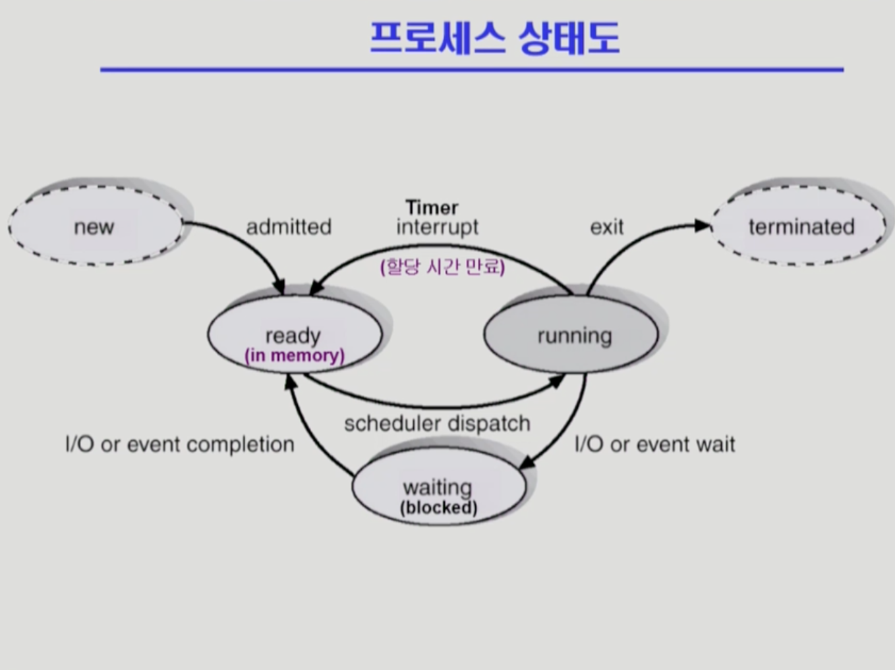
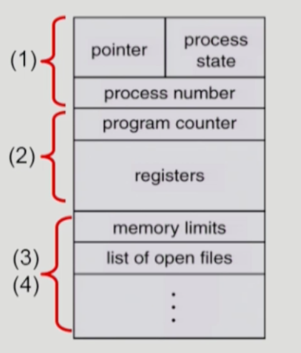

## [프로세스 #1](https://core.ewha.ac.kr/publicview/C0101020140318134023355997?vmode=f)

### 프로세스의 개념

- Process is **a program in execution**
- **프로세스의 문맥(context)**
  - **CPU 수행 상태**를 나타내는 하드웨어 문맥 (**CPU**와 관련)
    - Program counter
    - 각종 register
  - 프로세스의 주소 공간 (**메모리**와 관련)
    - code, data, stack
  - 프로세스 관련 커널 자료 구조
    - PCB (Process Control Block)
    - Kernal stack (시스템 콜하면 PC가 커널 주소공간을 가리킬 것입니다.)
- 프로세스의 문맥을 정확히 알아야 다른 프로그램을 실행하고, 다시 돌아와서 실행할 때 정확한 위치에서부터 다시 실행할 수 있습니다.

### 프로세스의  상태 (Process State)

- Running
  - **CPU를 잡고** instruction을 수행중인 상태
- **Ready**
  - **CPU를 기다리는** 상태 (디스크가 아니라 **메모리에 올려져 있는 상태**일 때)
- **Blocked (wait, sleep)**
  - **CPU를 주어도 당장 수행할 수 없는 상태**
  - Process 자신이 요청한 event가 즉시 만족되지 않아 이를 기다리는 상태
  - ex) 디스크에서 file을 읽어와야 하는 경우 
- New: 프로세스가 생성중인 상태
- Terminated: 수행이 끝난 상태
- 프로세스 상태도는 아래와 같습니다.
  

### Process Control Block(PCB)

- 운영체제가 각 프로세스를 관리하기 위해 **프로세스당 유지하는 정보**
- 다음의 구성 요소를 가집니다. (구조체로 유지)
  
  - (1) -> OS가 관리상 사용하는 정보
    - Process state(runnuing, wait 등), Process ID
    - scheduling information, priority
  - (2) -> CPU 수행 관련 하드웨어 값
    - Program counter, registers
  - (3) -> 메모리 관련
    - Code, data, stack의 위치 정보
  - (4) -> 파일 관련
    - Open file descriptions...

### 문맥 교환 (Context Switch)

- CPU를 한 프로세스에서 다른 프로세스로 넘겨주는 과정
- CPU가 다른 프로세스에게 넘어갈 때 운영체제는 다음을 수행합니다.
  - CPU를 내어주는 프로세스의 상태를 그 프로세스의 **PCB에 저장**
  - CPU를 새롭게 얻는 프로세스의 상태를 **PCB 에서 읽어옵**니다.
- System call이나 Interrupt 발생시 반드시 context switch가 일어나는 것은 아닙니다.
  - CPU 처리가 **프로세스에서 프로세스로 변경**할 때만 context switch가 일어납니다.
- **문맥 교환인지 아닌지 여부**
  - 프로세스가 변경되면 cache에 저장된 정보를 모두 지워야합니다.
  - 하지만 프로세스 A가 처리도중 system call 후에 다시 프로세스 A가 처리된다면, cache에 저장된 정보를 모두 지울 필요가 없습니다.
  - 다만 프로세스 A 처리도중 system call 을 만나고 그 이후에 프로세스 B가 처리된다면, cache에 저장된 프로세스 A에 대한 정보를 모두 지울 것입니다. (cache memory flush)

### 프로세스를 스케줄링하기 위한 큐 `(00:36:42)`

- 

### 스케줄러 (Scheduler)

- 

## [프로세스 #2](https://core.ewha.ac.kr/publicview/C0101020140321141759959993?vmode=f)

### 질문 답변 > [1, 2장 운영체제 개요 및 컴퓨터시스템의 구조](운영체제/1,-2장-운영체제-개요-및-컴퓨터시스템의-구조.md)

### Thread

- 

## 프로세스 #3

### Single and Multithreaded Processes

- 

### Benefits of Threads

- 

### Implementation of Threads

-