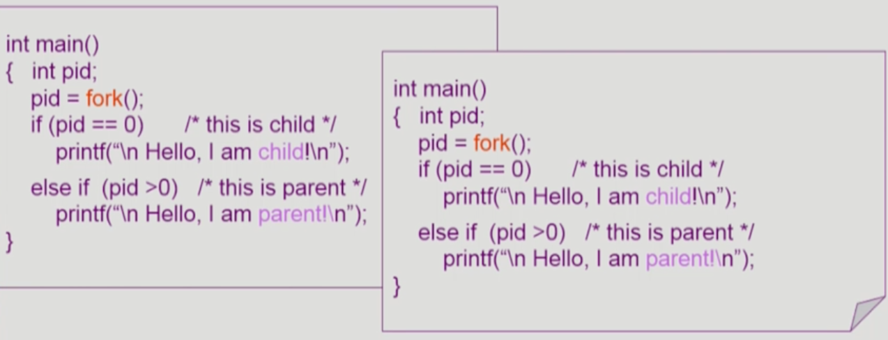
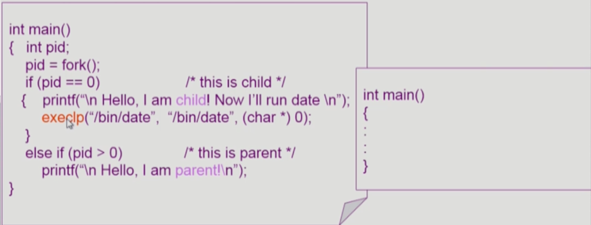
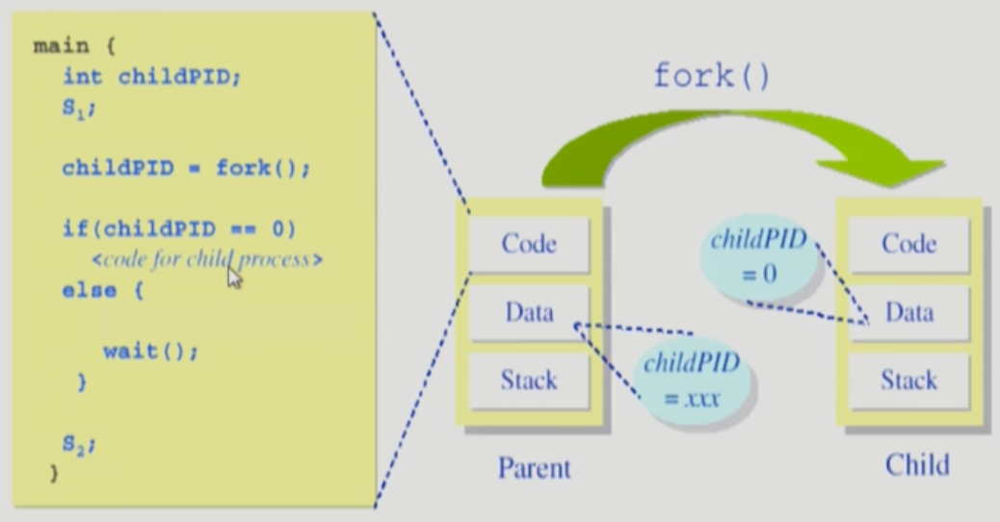
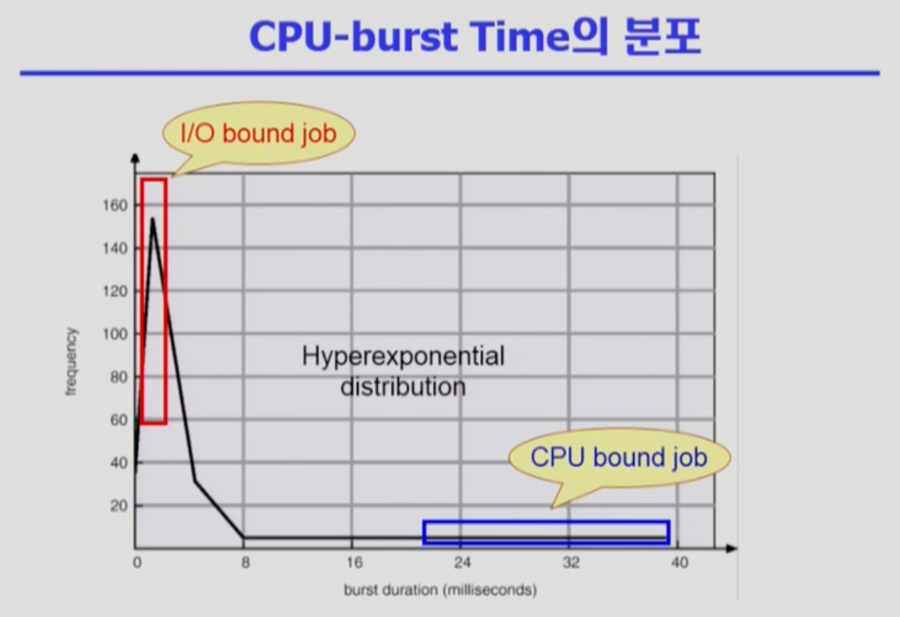

## [프로세스 관리 #1](https://core.ewha.ac.kr/publicview/C0101020140321144554159683?vmode=f)

### 프로세스 생성 (Process Creation)

- **부모 프로세스가 자식 프로세스 생성**
  - 주소 공간 (Address space)
    - 자식은 부모의 공간을 **복사**합니다. (binary and OS data)
    - 자식은 그 공간에 새로운 프로그램을 올림
  - 유닉스의 예
    - **fork ()** 시스템 콜이 새로운 프로세스를 생성
      - 부모를 그대로 복사 (OS data except PID + binary)
      - 주소 공간 할당
    - fork 다음에 이어지는 **exec()** 시스템 콜을 통해 새로운 프로그램을 메모리에 올림
- 프로세스의 **트리**(계층 구조) 형성
- 프로세스는 자원을 필요로 합니다.
  - **운영체제**로부터 받습니다.
  - **부모**와 **공유**합니다.
    - 부모와 자식이 모든 자원을 공유하는 모델
    - 일부를 공유하는 모델
    - 전혀 공유하지 않는 모델
- 수행 (Execution)
  - 부모와 자식이 공존
  - 자식이 종료(terminate)될 때까지 부모가 기다리는(wait) 모델

### 프로세스 종료 (Process Termination)

- 프로세스가 마지막 명령을 수행한 후 운영체제에게 이를 알려줌 (**exit**)
  - 자식이 **부모에게 output data**를 보냅니다. (via **wait**)
  - 프로세스의 각종 **자원**들이 운영체제에게 **반납**됩니다.
- 부모 프로세스가 자식의 수행을 종료 (**abort**)
  - 자식이 할당 자원의 한계치를 넘어설 때
  - 자식에게 할당된 태스크가 더 이상 필요하지 않을 때
  - 부모가 종료(exit)하는 경우
    - 운영체제는 부모 프로세스가 종료하는 경우 자식이 더 이상 수행되도록 두지 않습니다.
    - 단계적인 종료 (**자식 종료 -> 부모 종료**)

## [프로세스 관리 #2](https://core.ewha.ac.kr/publicview/C0101020140325134428879622?vmode=f)

**Copy-on-write (COW)**

### 프로세스와 관련한 시스템콜

- fork() : **create a child (copy)**

  - A process is created by the `fork()` system call.
    - creates a new address space that is a duplicate of the caller
  - 부모의 **context**도 복제 (특히 program counter 복제)

  

- exec() : **overlay new image**

  - A process can excute a different program by the `exec()` system call.
    - replaces the memory image of the caller with a new program

  

  

- wait() : **sleep until child is done**

  - 프로세스 A가 wait() 시스템 콜을 호출하면
    - 커널은 child가 종료될 때까지 프로세스 A를 sleep 시킵니다. (block)
    - Child process가 종료되면 커널은 프로세스 A를 깨웁니다. (ready)

  

- exit() : **frees all the resources, notify parent**

  - **프로세스의 종료**
    - 자발적 종료
      - 마지막 명령 수행 후 exit() 시스템 콜
      - 프로그램에 명시적으로 적어주지 않아도 main 함수가 리턴되는 위치에 컴파일러가 넣어줌
    - 비자발적 종료
      - 부모 프로세스가 자식 프로세스를 **강제 종료**
        - 자식 프로세스가 **한계치를 넘어서는 자원 요청**
        - 자식에게 할당된 태스크가 더 이상 **필요하지 않음**
      - 키보드로 **kill, break** 등을 친 경우
      - **부모가 종료**하는 경우
        - 부모 프로세스가 종료하기 전에 **자식들이 먼저 종료**

### 프로세스 간 협력 `(00:37:49)`

- 독립적 프로세스 (Independent process)
  - 프로세스는 각자의 주소 공간을 가지고 수행되므로 **원칙적으로 하나의 프로세스는 다른 프로세스의 수행에 영향을 미치지 못합**니다.
- 협력 프로세스 (Cooperating process)
  - **프로세스 협력 메커니즘**을 통해 하나의 프로세스가 다른 프로세스의 수행에 영향을 미칠 수 있습니다.
  - **프로세스 간 협력 메커니즘 (IPC: Interprocess Communication)**
    - **메시지**를 전달하는 방법
      - **메시지를 전달할 때 커널을 통해서 전달**한다!! -> 즉 **운영체제의 개입**이 필요
      - Message Passing
        - **Message system**
          - 프로세스 사이에 **공유 변수(shared variable)를 일체 사용하지 않고 통신**하는 시스템
        - **Direct Communication**
          - 통신하려는 **프로세스의 이름을 명시적**으로 표시
        - **Indirect Communication**
          - mailbox (또는 port)를 통해 메시지를 **간접 전달**
    - **주소 공간**을 공유하는 방법
      - **shared memory**
        - 서로 다른 프로세스 간에도 일부 주소 공간을 공유하게 하는 shared memory 메커니즘이 있습니다.
        - **thread**: thread는 사실상 하나의 프로세스이므로 프로세스 간 협력으로 보기는 어렵지만 **동일한 process를 구성하는 thread들 간**에는 **주소 공간을 공유하므로 협력**이 가능합니다.

### CPU and I/O Bursts in Program Execution

- **CPU Burst** 와 **I/O Burst** 가 반복됩니다.

### CPU-burst Time의 분포

### 프로세스의 특성 분류

- 프로세스는 그 특성에 따라 다음 두 가지로 나뉩니다.
  - I/O-bound process
    - CPU를 잡고 계산하는 시간보다 I/O에 많은 시간이 필요한 job (many short CPU bursts)
  - CPU-bound process
    - 계산 위주의 job (few very long CPU bursts)

### CPU Scheduler & Dispatcher

- CPU Scheduler

  - Ready 상태의 프로세스 중에서 이번에 CPU를 줄 프로세스를 고릅니다.

- Dispatcher

  - CPU scheduler에 의해 **CPU 제어권을 선택된 프로세스에게 넘깁**니다.
  - 이 과정을 context switch(문맥 교환)라고 합니다.

- CPU 스케줄링이 필요한 경우는 프로세스에게 다음과 같은 상태 변화가 있는 경우입니다.

  1. Running -> blocked (예: I/O 요청하는 시스템 콜)

  2. Running -> Ready (예: 할당시간 만료로 timer interrupt)

  3. Blocked -> Ready (예: I/O 완료후 인터럽트)

  4. Terminate

- **1, 4** 스케줄링은 nonpreemptive (= 강제로 빼앗지 않고 **자진 반납**)

- All other scheduling is preemptive (=**강제**로 빼았음)