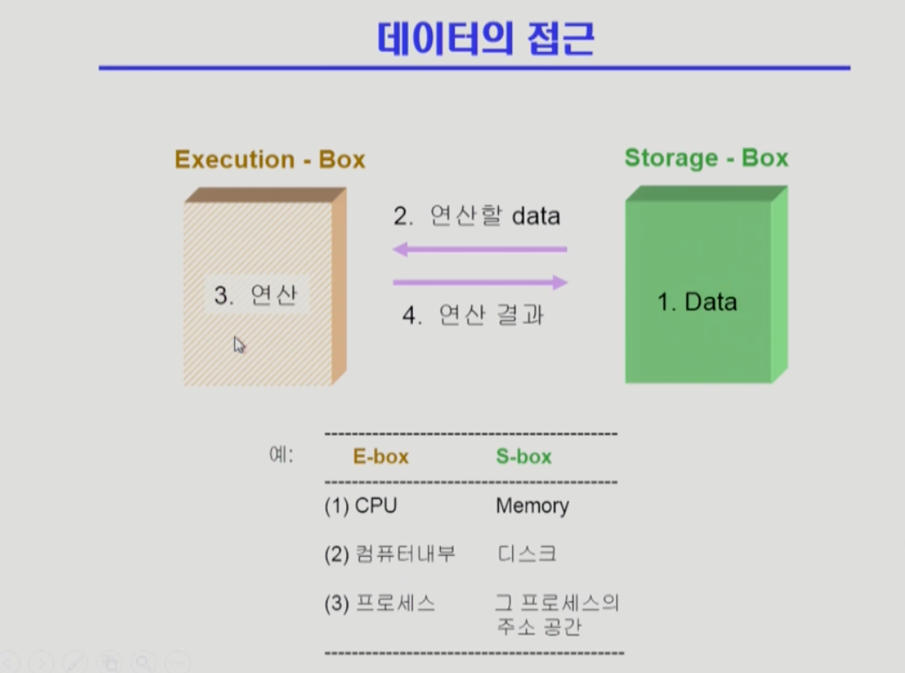

## [프로세스 동기화 #1](https://core.ewha.ac.kr/publicview/C0101020140401134252676046?vmode=f)
39분 부터 시작

### 데이터의 접근

### Race Condition

- S-box를 공유하는 E-box가 여럿 있는 경우 **Race Condition** 의 가능성이 있습니다.
  - **Multiprocessor system**
  - **공유 메모리**를 사용하는 프로세스들
  - **커널 내부 데이터를 접근**하는 루틴들 간 (예: 커널모드 수행 중 인터럽트로 커널모드 다른 루틴 수행)

### OS에서의 Race Condition

- 언제 발생하는가?
  - kernel 수행 중 인터럽트 발생 시
  - Process가 system call을 하여 kernel mode로 수행 중인데 context switch가 일어나는 경우
  - Multiprocessor에서 shared memory 내의 kernel data
- 해결책 
  - **커널 모드**에서 수행 중일 때는 CPU를 **preempt하지 않습**니다.
  - 커널 모드에서 사용자 모드로 돌아갈 때 preempt
  - Multiprocessor Case:
    - 방법1: 한번에 **하나의 CPU만이 커널에 들어갈 수 있게** 하는 방법
    - 방법2: 커널 내부에 있는 각 공유 데이터에 접근할 때마다 그 **데이터에 대한 lock / unlock**을 하는 방법

### Process Synchronization 문제

- 공유 데이터(shared data)의 동시 접근(concurrent access)은 데이터의 **불일치 문제(inconsistency)**를 발생시킬 수 있다.
- **일관성(consistency)** 유지를 위해서는 협력 프로세스(cooperating process) 간의 **실행 순서(orderly execution)**를 정해주는 메커니즘이 필요합니다.
- **Race condition**
  - 여러 프로세스들이 동시에 공유 데이터를 접근하는 상황
  - 데이터의 최종 연산 결과는 **마지막에 그 데이터를 다룬 프로세스**에 따라 달라집니다.
- race condition을 막기 위해서 concurrent process는 **동기화(synchronize)**되어야 합니다.

- **The Critical-Section Problem**
  - n 개의 프로세스가 공유 데이터를 동시에 사용하기 원하는 경우
  - 각 프로세스의 code segment에는 공유 데이터에 접근하는 코드인 **critical section**이 존재합니다.
  - Problem
    - **하나의 프로세스가 critical section에 있을 때** 다른 모든 프로세스는 critical section에 들어갈 수 없어야 한다.

## [프로세스 동기화 #2](https://core.ewha.ac.kr/publicview/C0101020140404151340260748?vmode=f)

### Semaphores

- 

### Critical Section of n Processes

- 

### Block / Wakeup Implementation

- 

### Two Types of Semaphores

- 

### Deadlock and Starvation

- 

## [프로세스 동기화 #3](https://core.ewha.ac.kr/publicview/C0101020140408134626290222?vmode=f)

## [프로세스 동기화 #4](https://core.ewha.ac.kr/publicview/C0101020140411143154161543?vmode=f)

### Classical Problems of Syncronization

- Bounded-Buffer Problem (Producer-Consumer Problem)
- Readers-Writers Problem
- Dining-Philosophers Problem

### Monitor

-