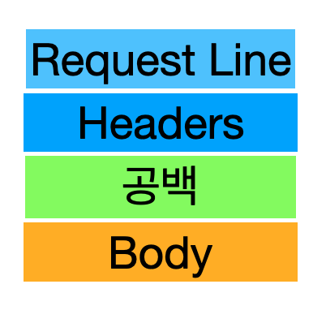
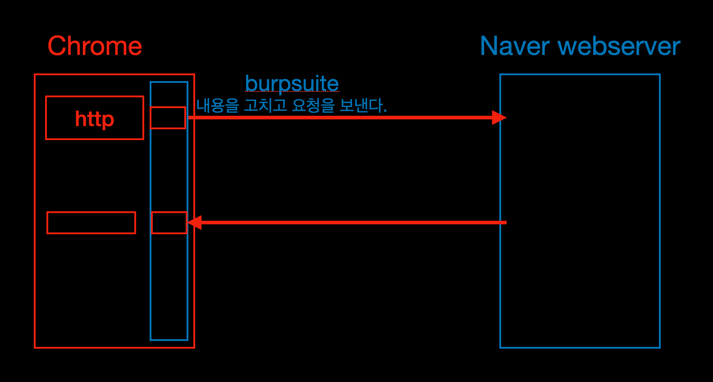

## [HTTP 프로토콜](https://youtu.be/TwsQX1AnWJU?list=PL0d8NnikouEWcF1jJueLdjRIC4HsUlULi)  

### 웹을 만드는 기술들
- http(https -> ssl/tls) 
- html 웹페이지를 채울 내용
- javascript 웹 페이지에 들어갈 기능
- css 웹 페이지를 예브게 꾸밀 디자인  
- asp/asp.net
- jsp
- php 이거 세개는 서버에서 동작하는 것, 웹 서버 페이지를 만드는 기술
- db     
- python
- spring
- Jquery
- Ajax

### HTTP 프로토콜의 특징
- HyperText Transfer Protocol(하이퍼 텍스트 전송 프로토콜)  
- www에서 쓰이는 핵심 프로토콜로 문서의 전송을 위해 쓰이며, 오늘날 거의 모든 웹 애플리케이션에서 사용되고 있다.   
    -> 음성, 화상 등 여러 종류의 데이터를 MIME로 정의하여 전송 가능
  
- HTTP 특징  
    Request/ Response(요청/ 응답) 동작에 기반하여 서비스 제공
  
HTTP 1.0의 특징
- "연결 수립, 동작, 연결 해제"의 단순함이 특징 -> 하나의 URL은 하나의 TCP연결
    HTML 문서를 전송 받은 뒤 연결을 끊고 다시 연결하여 데이터를 전송한다.
  
- HTTP 1.0의 문제점   
    단순 동작(연결 수립, 동작, 연결 해제)이 반복되어 통신 부하 문제 발생
    매번 TCP 3way handshake 를 하고 또 HTTP 요청에 대한 응답을 받으면 연결을 끊어서 다시 처음부터 반복해야했다.
  
 HTTP/1.1  
한번연결 하면 받을 꺼 다 받고 연결을 종료하라는 의미  

## [HTTP 요청 프로토콜](https://youtu.be/rxaBwwI_JnI?list=PL0d8NnikouEWcF1jJueLdjRIC4HsUlULi)
### 요청 프로토콜의 구조

- HTTP Method 설명 중 GET, POST만 사용해야 한다고  
  하지만 개발자 입장에서  
  RESTful API 개발시 PUT, DELETE도 사용하는게 원칙임
  
리퀘스트 라인 : 요청타입 공백 URI 공백 HTTP버전

### 요청타입
- GET 문서를 읽어오려 할 때 사용
- POST 클라이언트가 데이터를 원할 때 
- PUT 특정자원 업로드할 때 
- Delete 제거할 때 

## [URL, URI란?](https://youtu.be/2ikhZ_fNP5Y?list=PL0d8NnikouEWcF1jJueLdjRIC4HsUlULi)
URI(Uniform Resource Identifier)  
- 인터넷 상에서 특정 자원을 나타내는 유일한 주소  
scheme://host[:post][/path][?query]  
  ex) ftp://IP주소:포트/파일이름  
  ex) http://IP주소:포트/폴더이름/파일이름  

## [HTTP 요청 프로토콜 작성 실습](https://youtu.be/XbGJYsxed2w?list=PL0d8NnikouEWcF1jJueLdjRIC4HsUlULi)

....(작성할만한 내용이 없었다.)

## [URI 이해를 위한 실습](https://youtu.be/HBojczyd1Ac?list=PL0d8NnikouEWcF1jJueLdjRIC4HsUlULi)

1. 자바 jdk 설치
3. PATH 를 지정한다. (내컴퓨터 우클릭 설정 - 고급시스템설정- 고급탭,환경변수설정 - 시스템변수는 모든 사용자에게 적용된다. - PATH를 찾아서 편집한다.)
1. JAVA_HOME이라는 환경분수를 새로만들어서 자바파일에 만들어주기
1. cmd를 다시 실행해서 javac -version해서 버전이 나오면 잘 입력한 것이다.
4. apache-tomcat 설치 = 압축풀면 끝 
1. tomcat/bin 에서 startup.bat을 실행하면 된다.
1. 192.168.0.100:8080 에 들어가면 된다.
1. tomcat/webapps/abs/def/hij/kim.txt 를 만든다. 
1. 이 파일을 접근하려면 https://192.168.0.100:8080/abc/def/hij/kim.txt라고 하면 경로의 파일에 접근이 가능하다.
1. 확장자 .jsp로 파일을 만들고 메모장으로 편집힌다.
1. query에 정보를 전달하면 그것을 화면에 띄워주고 더해주는 jsp를 만들고
1. https://192.168.0.100:8080/abc/def/hij/qqq.jsp?num1=10&num2=40
- 

## [HTTP 응답 프로토콜](https://youtu.be/kuucNF4Zvbs?list=PL0d8NnikouEWcF1jJueLdjRIC4HsUlULi)

### 응답프로토콜의 구조
사용자가 볼 웹페이지를 담고있다.   

|Status Line|  
|-----------|  
|Headers|  
|공백|  
|Body|  

### HTTP/1.1 200 OK
HTTP버전,공백, 상태코드, 공백, 상태문구

|상태코드 종류|설명|
|----------|---|
|100~199|단순한 정보|
|**200~299**|client 의 요청이 성공|
|300~399|client의 요청이 수행되지 않아 다른 url로 재지정|
|**400~499**|client의 요청이 불완전하여 다른 정보가 필요|
|**500~599**|Server의 오류를 마나거나 Client의 요청 수행불가|

|상태코드 종류|상태문구|설명|
|-----|-----|----|
|200|OK|Client의 요청이 성공했다는 것을 나타낸다|
|403|Forbidden|Client가 권한이 없는 페이지를 요청했을 때|
|404|Not Found|Client가 서버에 없는 페이지를 요청했을 때|
|500|Internal Server Error|Server의 일부가 멈췄거나 설정 오류가 발생|
|503|Service Unavailable|최대 Session 수를 초과했을 때|

## [HTTP 헤더 포맷](https://youtu.be/mQTGmxendk8?list=PL0d8NnikouEWcF1jJueLdjRIC4HsUlULi)

### HTTP 헤더 포맷
- 일반헤더 (일반적인 정보를 담고 있는)

|헤더종류|설명|
|----|----|
|Content-Length|메시지 바디길이를 나타낼 때 쓰인다|
|Content-Type|메시지 바디에 들어있는 컨텐츠 종류  (ex:HTML문서는 text/html)|

- 요청헤더

|헤더종류|설명|  
|---|---|  
|Cookie|서버로부터 받은 쿠키를 다시 버서에게 보내주는 역할을 한다.|
Host|요청한 URL에 나다난 호스트명을 상세하게 표시(HTTP 1.1은 필수)|
User-Agent|Client Program에 대한 식별 사능 정보를 제공|

- 응답헤더

|헤더종류|설명|  
|---|---| 
|Server|사용하고 있는 웹서버의 소프트웨어에 대한 정보를 포함|
|Set-Cookie|쿠키를 생성하고 브라우저에 보낼 때 사용, 해당 쿠키값을 브라우저가 서버에게 다시 보낼 때 사용한다.|

## [HTTP 프로토콜 분석 실습](https://youtu.be/dhMrKTwNI8U?list=PL0d8NnikouEWcF1jJueLdjRIC4HsUlULi)

- proxy , intercept 기능 이용
- 크롬 falcon proxy 확장프로그램으로 성정할 수 있다.
- (ㅋㅋㅋㅋ 우클릭 하는 법을 배우다니.... rightClickOpneYn..)