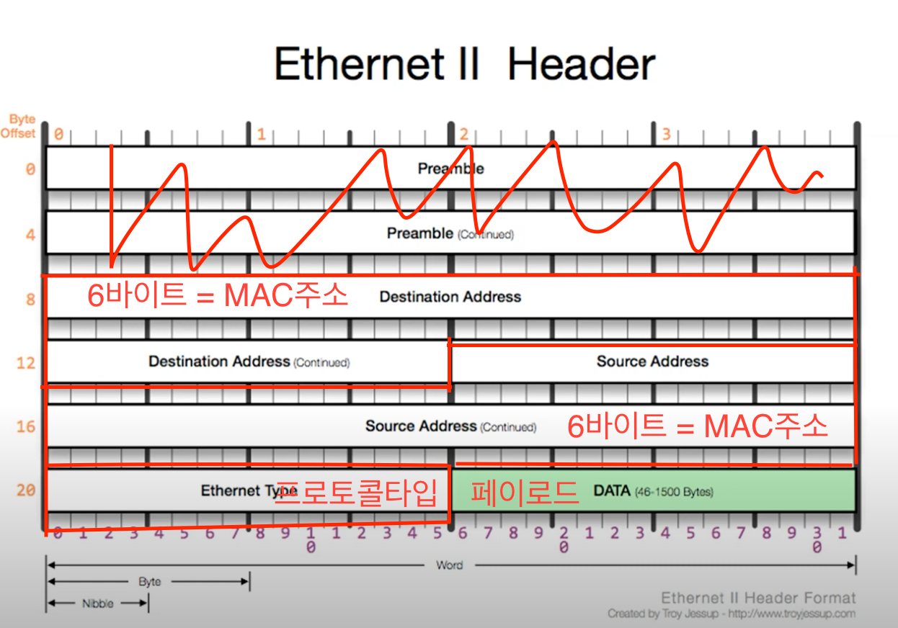

영상: [[따라學IT] 03. 가까이 있는 컴퓨터끼리는 이렇게 데이터를 주고받는다](https://youtu.be/HkiOygWMARs?list=PL0d8NnikouEWcF1jJueLdjRIC4HsUlULi)

가까이 있는 컴퓨터끼리 어떻게 데이터를 주고 받는지 알아보는 것이 2계층에서 하는 일
### 2계층에서 하는일

#### 2계층의 기능
2계층은 하나의 네트워크 대역   
즉, 같은 네트워크 상에 존재하는 여러 장비들 중에서 어떤 장비가 어떤 장비에게 보내는 데이터를 전달  
<br>
추가적으로 오류제어, 흐름 제어를 수행한다.  
+ **흐름제어**: 누가누구에게 데이터를 보내는지 흐름을 제어하는 것  
+ **오류제어**: 데이터에 오류가 있는지 없는지 체크하는 것  

#### 2계층의 네트워크 크기
2계층은 하나의 네트워크 대역 **LAN에서만** 통신할 때 사용한다.

다른 네트워크와 통신할 때는 항상 3계층이 도와주어야 한다.

3계층의 주소와 3계층의 프로토콜을 이용하여야만 다른 네트워크와 통신이 가능하다.

### 2계층에서 사용하는 주소
#### MAC 주소
물리적인 주소라고 부른다.

LAN에서 통신할 때 사용하는 주소

16진수로 쓰고 16진수 2개씩 6묶음 총 12개의 16진수로 이루어져있다.

앞에 16진수 3묶음은 **OUI**: IEEE에서 부여하는 일종의 제조회사 식별 ID

뒤에 16진수 3묶음은 **고유번호**: 제조사에서 부여한 고유번호

고유번호이기 때문에 MAC주소는 쉽게 바꾸지 않는다.


### 2계층(Ethernet) 프로토콜



프로토콜 타입 : 페이로드 안의 상위 프로토콜이 무엇인지 알려주는 부분
2바이트 IPv4(0x0800) , ARP(0x0806) 
두가지가 올 수 있다.

### 실습
window = cmd => 
```
ipconfig /all
```
mac = terminal =>
```
ifconfig
```


