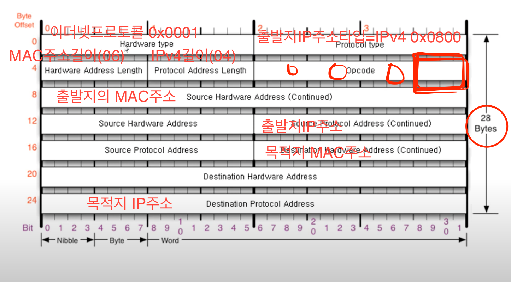

## [ARP 프로토콜](https://youtu.be/LDsp-Xb168E?list=PL0d8NnikouEWcF1jJueLdjRIC4HsUlULi)

### ARP가 하는 일
ARP프로토콜은 같은 네트워크 대역에서 통신을 하기 위해 필요한 MAC주소를 IP주소를 이용해서 알아오는 프로토콜이다.
같은 네트워크 대역에서 통신을 한다고 하더라도  
데이터를 보내기 위헤서는 7계층부터 갭슐화를 통해 데이터를 보내기 때문에
IP주소와 MAC주소가 모두 필요하다.
이때 IP주소는 알고 MAC주소는 모르더라도
ARP를 통해 통신이 가능하다.

### ARP프로토콜의 구조
이더넷 프로토콜만 목적지가 먼저 나오고

나머지 프로토콜은 출발지가 먼저 나온다.

OPCODE:

0001 = 주소 물어볼 때        
0002 = 답을 줄 때

-

## ARP 프로토콜의 통신 과정
IP주소만 알고 있을 때

ARP로 MAC주소를 알아오기

같은 LAN 대역에서 ㄱ컴터(IP:192.168.0.10,MAC:aa:aa:aa:aa:aa:aa)가

ㄷ컴터(IP:192.168.0.30,MAC:cc:cc:cc:cc:cc:cc)의 MAC주소를 알아와야한다.

먼저 ㄱ컴터가 (ETH+ARP요청)캡슐화   
목적지 MAC주소를 모르는데 어떻게 이더넷프로토콜과 에이아피를 쓰나?  
모르는 부분은 0으로 채워서 보낸다.  
ARP요청  
|2바이트|2바이트|
|---|---|  
|00 01|08 00|  
|06 04|00 01|  
|aa aa| aa aa|  
|aa aa|c0 a8|  
|00 0a|00 00|  
|00 00|00 00|  
|c0 a8 | 00 1e|

이더넷
|2바이트|2바이트|
|---|---|  
|FF FF|FF FF|  
|FF FF|aa aa|
|aa aa|aa aa|
|08 06||

전부다 1로 하면 브로트캐스트가 된다. 모르기 때문에 모두에게 준다.
가운데에 스위치라는 장비가 브로트캐스트인걸 보고  
네트워크의 모두애게 뿌린다.
받은 모두는 디캡슐레이션을 해서 2계층을 보고. 브로드캐스트니까 3계층인 ARP를 깐다.  
본인의 아이피랑 목적지 아이피 주소가 일치한 애만  
이 요청에 대한 응답 프로토콜을 만들어서 보낸다.
ARP요청  
|2바이트|2바이트|
|---|---|  
|00 01|08 00|  
|06 04|00 02|  
|cc cc| cc cc|  
|cc cc|c0 a8|  
|00 1e|aa aa|  
|aa aa|aa aa|  
|c0 a8 | 00 0a|

이더넷
|2바이트|2바이트|
|---|---|  
|aa aa|aa aa|  
|aa aa|cc cc|
|cc cc|cc cc|
|08 06||

ARP 캐시 테이블에 해당 아이피의 MAC주소를 넣어준다.

## ARP 테이블
나와 통신했더너 컴퓨터들
윈도우 명령어: arp -a
통신 했던 컴퓨터들의 주소는 ARP테이블에 남는다.

## [ARP 프로토콜 실습](https://youtu.be/-M_S50Ga384?list=PL0d8NnikouEWcF1jJueLdjRIC4HsUlULi)
윈도우 명령창에서 arp -a 를 치면 해쉬 테이블을 볼 수 있다.
arp의 특징은 같은 네트워크 층에서만 쓰인다.
3계층장비는 브로트캐스트는 외부 네트워크로 보내지 않는다.
그래서 같은 네트워크에서만 쓰인다.

arp 프로토콜의 info에 ?가 있으면 요청  ?가 아니면 응답이다. 

