## [IPv4 프로토콜](https://youtu.be/_i8O_o2ozlE?list=PL0d8NnikouEWcF1jJueLdjRIC4HsUlULi)

### IPv4가 하는 일

- 네트워크 상에서 데이터를 교환하기 위한 프로토콜
- 데이터가 정확하게 전달 될 것을 보장하지 않는다.
- 중복된 패킷을 전달하거나 패킷의 순서를 잘 못 전달 할 가능성도 있다.
- (악의적으로 이용되면 DoS 공격이 됨)
- 데이터의 정확하고 순차적인 전달은 그보다 상위 프로토콜인 TCP에서 보장한다.
### IPv4 프로토콜의 구조
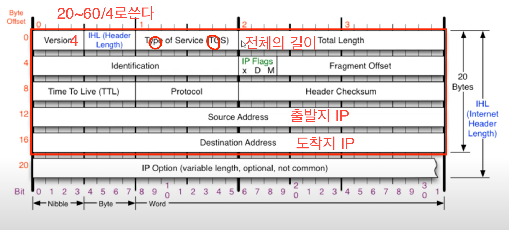
2번째 라인은 한개의 세트라고생각하다.  
- Identification: 데이터가 길어서 나눠서 보내고 다시 받아서 합칠 때 같은 아이들끼리만 모으기 위해서 ID를 사용한다.  
- IP Flags: 3bit 중에서 2번째 D: 패킷 보내는 사람이 데이터를 안에서 보내겠다는 말 하지만 데이터를 한개로 보내는 경우 다 손실되서 사용을 안한다.
3bit 중에서 3번째 M:조각화가 진행되면 이 자리가 1이되고 최대로 보낼 수 있는 거보다 작으면 0이되고 한번만 보낸다. 
- Fragment Offset: 잘게 자른 아이들의 순서를 맞춰보기 위해 사용한다. 맨 처음 위치로부터 얼만큼 떨어져있는 아이인지 알려준다.  
첫번째는 0, 두번째는 첫번째아이의 크기, 세번쩨는 두번째아이가 끝나는 위치,,,,,
  
- TTL(Time To Live): 살기위한 시간? 패킷이 살아있을 수 있는 시간: 네트워크가 한 곳에서만 돌면 서로 공격하게 되기 때문에  
라우터를 지날 때마다 -1 해서 0이되면 더 패킷이 움직이게 하지 않게 한다.  
  이 값을 가지고 상대의 운영체제의 종류를 알 수 있다. 윈도우는 128, 리눅스는 64로 설정되기 때문에  
  
- Protocol: 상위 프로토콜이 먼지 알려준다. ICMP = 01,TCP=06 ,UDP= 0x11 (17)
- Header Checksum: 헤더에 오류가 있는지 없는지 확인하는 부분 

## [ICMP 프로토콜](https://youtu.be/JaBCIUsFE74?list=PL0d8NnikouEWcF1jJueLdjRIC4HsUlULi)
### ICMP가 하는 일
- ICMP(internet control messagy protocol, 인터넷 제어 메시지 프로토콜)
- 네트워크 컴퓨터 위에서 돌아가는 운영체제에서 오류메시지를 전송 받는데 주로 쓰인다.
- 프로토콜 구조의 type과 code를 통해 오류 메시지를 전송받는다.
### ICMP 구조
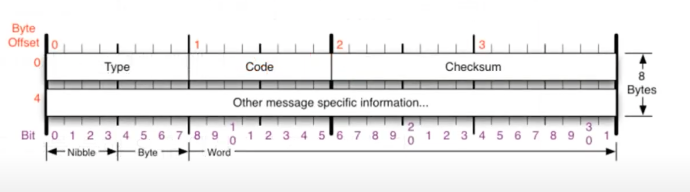
- Type: 대분류: 0- Echo Reply, 8 - Echo, 3,11 - 먼가 잘못됬을 때, 5-보안상 알아야하는 것
  
8번 = 요청, 0번 = 응답, 
3번 = 목적지 도달 안됨(목적지로 가지 못함, 가는 도중에 못 갔을 때)
11번 = 시간초과(목적지로 갔는데 요청을 못 받은 것, 보통 방화벽이 막았을 때)
5번 = 원격지의 라우팅 테이블을 수정하는 것 - 나쁜짓을 할 수있다는 말이다. 

- Code: 소분류: 
- Checksum: 맞는지 보는 것

## [IPv4, ICMP프로토콜 실습](https://youtu.be/8ZwTvTuZlVw?list=PL0d8NnikouEWcF1jJueLdjRIC4HsUlULi)
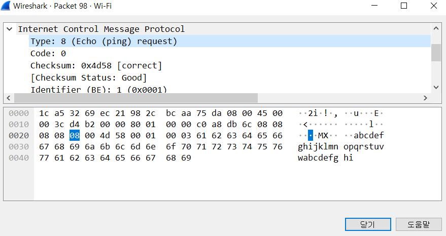
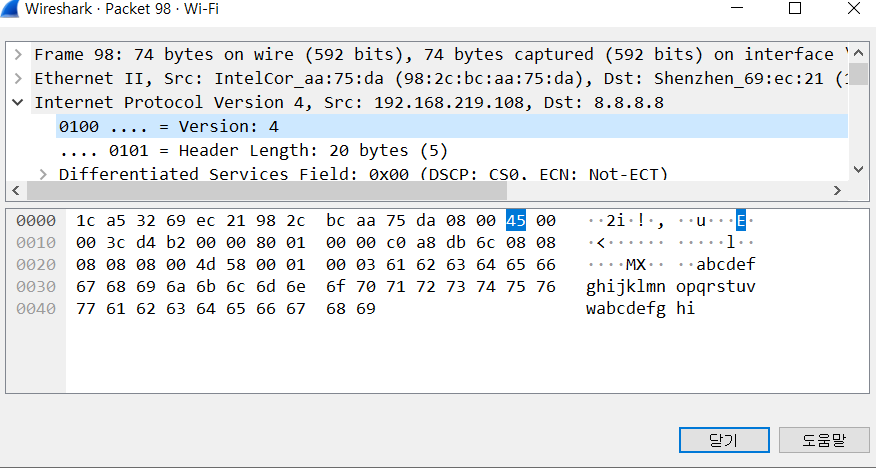

## [라우팅 테이블](https://youtu.be/CjnKNIyREHA?list=PL0d8NnikouEWcF1jJueLdjRIC4HsUlULi)
### 내가 보낸 패킷은 어디로 가는가? = 라우팅 테이블
cmd netstat -r
라우팅 테이블에 있는 것만 찾아갈 수 있다.
지도에 넣어 주는 것

|네트워크 대상|네트워크 마스크|게이트웨이|인터페이스|메트릭|  
|---|---|---|---|---|  
|0.0.0.0|0.0.0.0|192.168.0.1|192.168.0.189|276|  

기본값으로 넣어준다. 
### 다른 네트워크와 통신 과정
world01 에 A라는 컴터가 있고 world02에 B라는 컴터가 있을 때  
A가 B에게 통신하려면 A의 라우팅 테이블에 
B에게 가려면 어떤 네트워크 대역에게 보내야하는지 있어서 그걸 보고 제일 가까운 애한테 보낸다.
그리고 받은 라우터는 이더넷프로토콜의 정보를 바꾸고 어떤 대역으로 가야하는지 바꿔서 또 보낸다.  
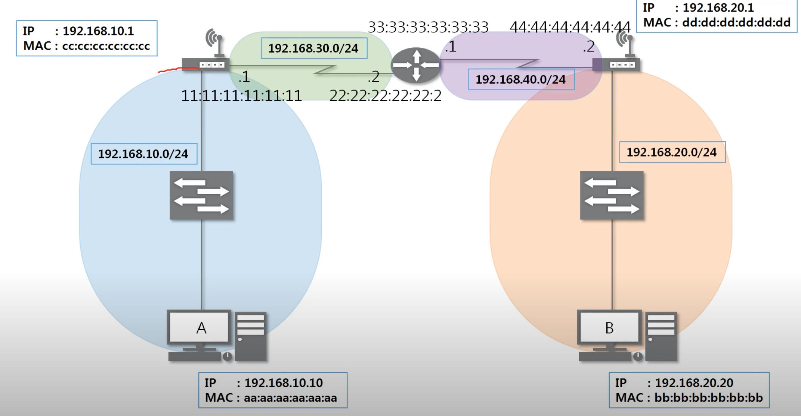
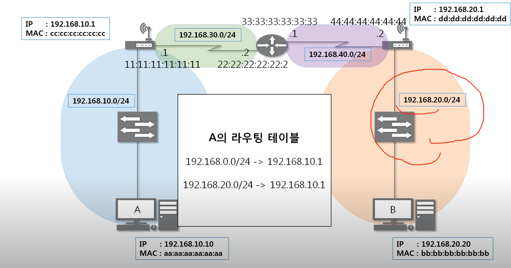
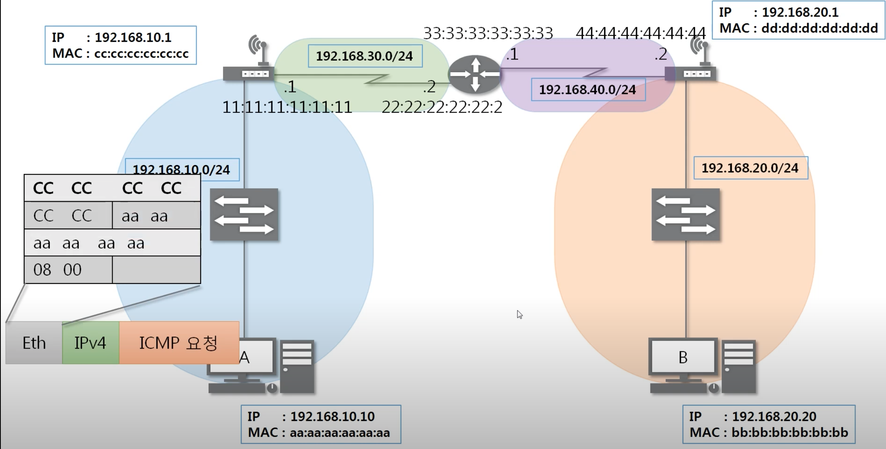
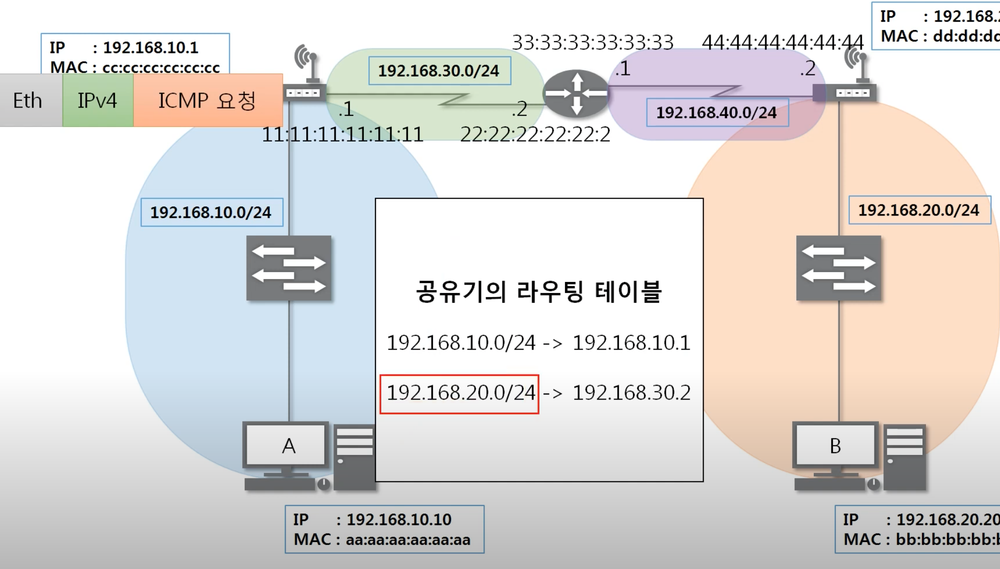
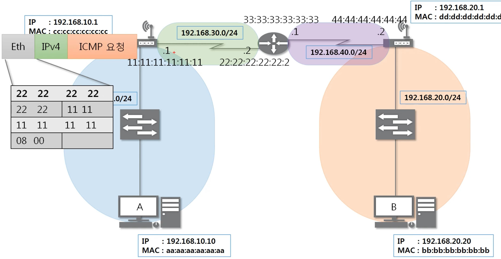

## [라우팅 테이블 확인 실습](https://youtu.be/tVntagSJctc?list=PL0d8NnikouEWcF1jJueLdjRIC4HsUlULi)
cmd netstat -r
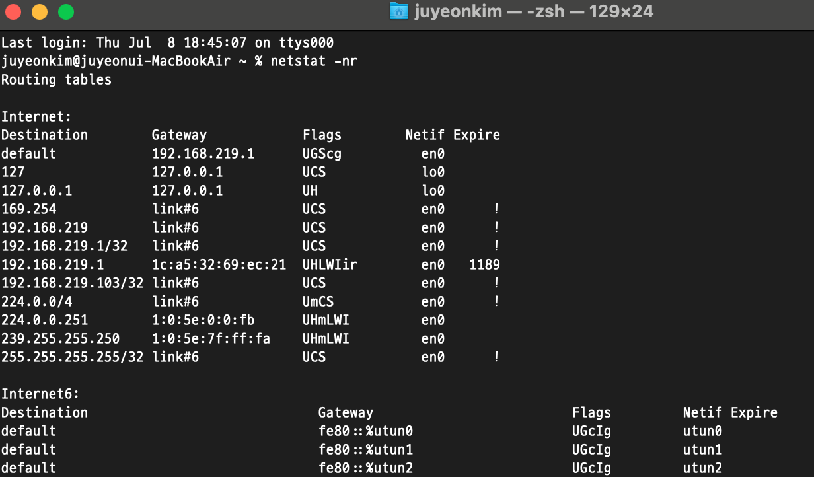

## [IPv4 조각화 이론](https://youtu.be/_AONcID7Sc8?list=PL0d8NnikouEWcF1jJueLdjRIC4HsUlULi)
### 조각화
- 큰 IP패킷들이 적은 MTU(Maximum Transmission Unit)를 갖는 링크를 통하여 전송되려면 여러개의 작은 패킷으로 쪼개어/ 조각화 되어 전송돼야한다.
- 즉, 목적지까지 패킷을 전달하는 과정에 통과하는 각 라우터마다 전송에 적합한 프레임으로 변환이 필요하다.
- 일단 조각화 되면, 최종 목적지에 도달할 때까지 재조립되지 않는 것이 일반적이다.
- IPv4에서는 발신지 뿐만 아니라 중간 라우터에서도 IP조각화가 가능하다.
- IPv6에서는 IP단편화가 발신지에서만 가능하다.
- 재조립은 항상 최종 수신지에서만 가능하다.
  

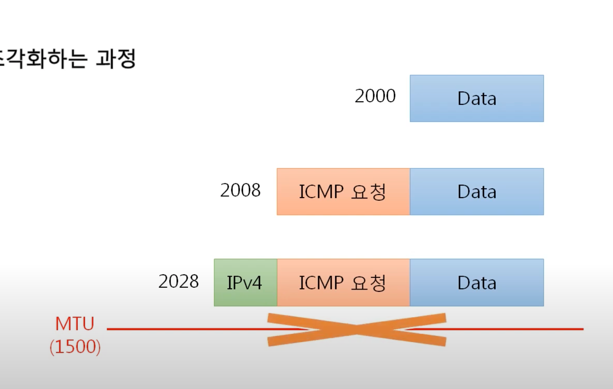
헤더의 길이 포함해서 MTU를 넘으면 안된다.
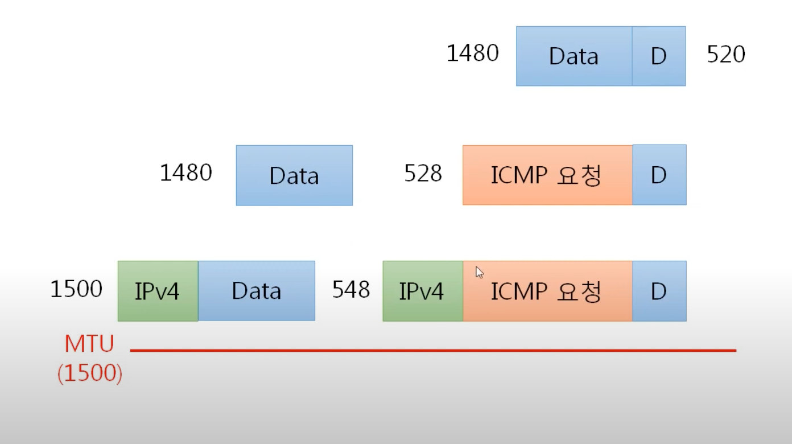
이더넷 프로토콜을 붙이기 전에 길이를 확인한다!
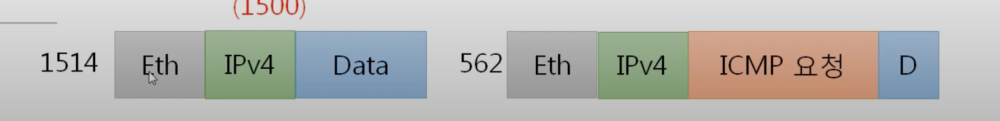
이너넷 프로토콜을 붙이고 나면 1514길이가 되서 패킷이 전달된다.

## [IPv4 조각화 실습](https://youtu.be/QKEL9aBgHtg?list=PL0d8NnikouEWcF1jJueLdjRIC4HsUlULi)

보내려는 데이터 크기: 2379
MTU: 980
몇개의 패킷이 되는가? 3개
첫번째 패킷으리 데이터의 크기는 몇인가? 960
마지막 패킷으리 데이터의 크기는 몇인가? 459
