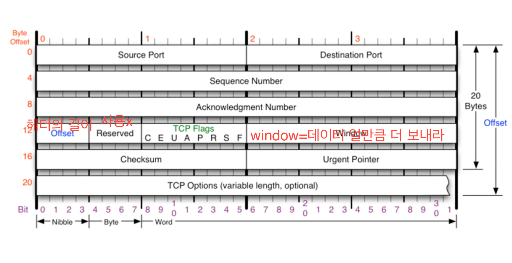
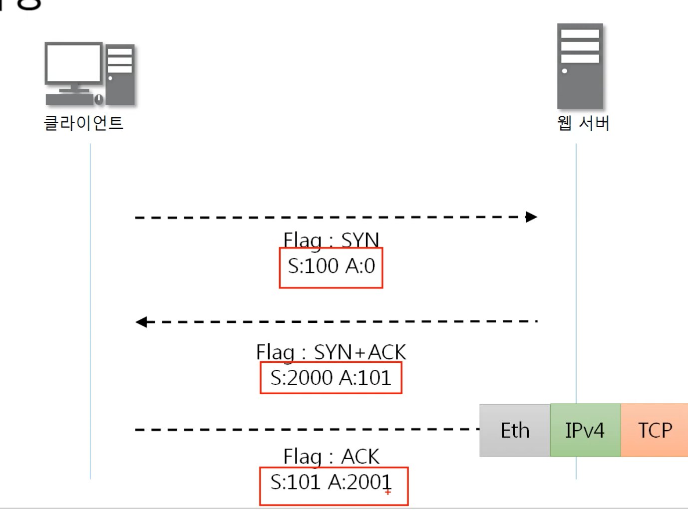
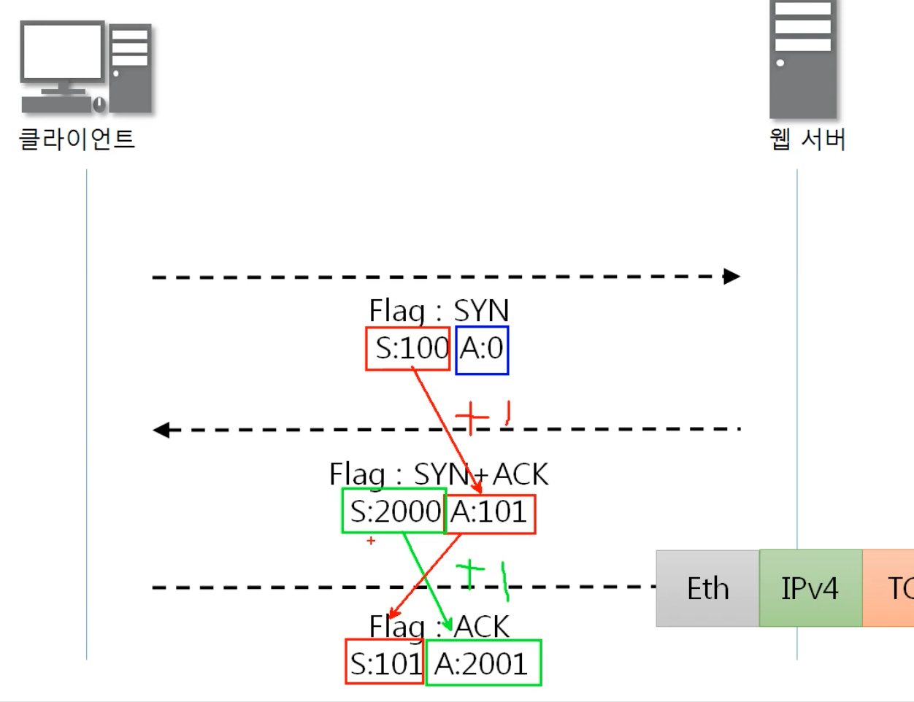
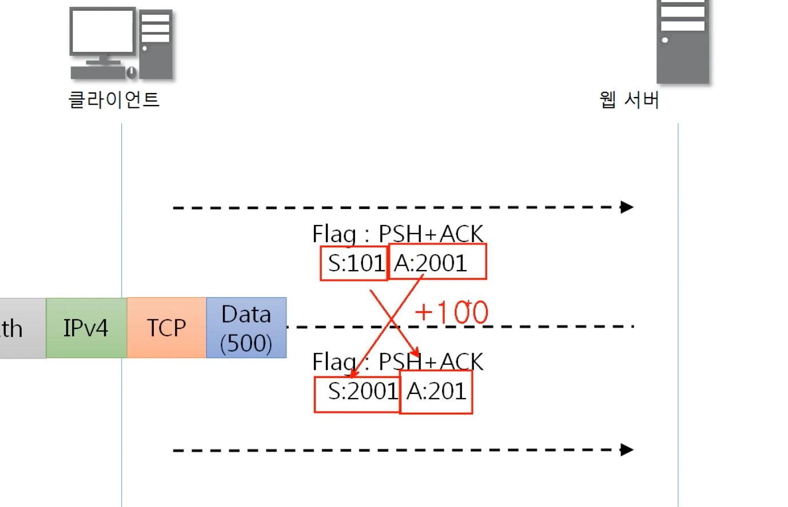
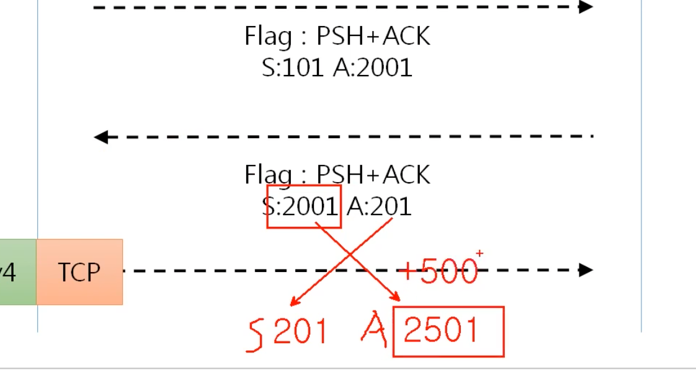

## [TCP 프로토콜](https://youtu.be/cOK_f9_k_O0?list=PL0d8NnikouEWcF1jJueLdjRIC4HsUlULi)
### TCP가 하는 일
- 전송 제어 프로토콜(Transmission Control Protocal, TCP)은 인터넷에 연결된 컴퓨터에서 실행되는 프로그램 간에 통신을 안정적으로, 순서대로,에러없이 교환 할 수 있게 한다.
  
- TCP의 안정성을 필요로 하지 않는 애플리케이션의 경우 일반적으로 TCP대신, 비접속형 사용자 데이터그램 프로토콜(UDP)을 사용한다.

- TCP는 UDP보다 안전하지만 느리다.
### TCP프로토콜의 구조
ip 프로토콜의 option이 붙는거 처럼 
20~60 바이트가 될 수 있다.

### TCP 플래그 구조
우아+ 프로스쀅스
- U: urgent,긴급 비트 (내가 보낸거 우선순위 높다?)  
    Urgent Pointer와 세트세트  (pointer 몰라도 돼요)
- A:Acknowledgment 응답을 해줄 때, 승인을 해줄 때 사용한다.
- P:Push, 계속해서 데이터를 밀어 넣겠다는 뜻
- R: Reset,초기화 비트, 상대방과 연결이 되어있는 상태에서 오류가 발생했을 때 연결을 새로고침하기 위해서 사용
- S⭐️: Syn bit, 동기화 비트,상대방과 연결을 시작할 때 무조건 사용하는 플레그
- F:Fin, 종료 비트, 연결을 끊을 때 사용하는 플레그
## TCP 플래그

- 

## [TCP 3Way Handshake](https://youtu.be/Ah4-MWISel8?list=PL0d8NnikouEWcF1jJueLdjRIC4HsUlULi)
TCP를 이용한 통신 과정
### 연결 수립 과정
- TCP를 이용한 데이터 통신을 할 때 프로세스와 프로세서를 연결하기 위해 가장 먼저 수행되는 과정
1. 클라이언트가 서버에게 요청 패킷을 보내고
2. 서버가 클라이언트의 요청을 받아들이는 패킷을 보내고
3. 클라이언트는 이를 최종적으로 수락하는 패킷을 보낸다.
 
위의 3개의 과정을 3Way Handshake라고 부른다.

### 3way handshake
클라이언트

최종

처음 클라이언트가 S= 100 A=0
서버가 보낼 때 랜덤한 S = 2000, A= 쫌전의 S+1
클라이언트가 서버에게 데이터를 달라고 할 때 
S= 서버가 보낸 A, A= 서버가 보낸 S +1 

## [TCP를 이용한 데이터 전송 과정](https://youtu.be/0vBR666GZ5o?list=PL0d8NnikouEWcF1jJueLdjRIC4HsUlULi)
### 데이터 송수신 과정
- TCP를 이용한 데이터 통신을 할 때 단순히 TCP패킷만을 캡슐화해서
  통신하는 것이 아닌 페이로드를 포함한 패킷을 주고 받을 때의 일정한 규칙
  

1.보낸 쪽에서 또 보낼 때는 SEQ번호와 ACK번호가 그대로다.
2. 받는 쪽에서 SEQ번호는 받은 ACK번호가 된다.
3. 받는 쪽에서 ACK번호는 받은 SEQ번호+ 데이터의 크기

   클라이언트가 보낸 데이터의 크기가 100이었기 때문에 클라이언트가 보낸 PSH + 100= 서버의ACK  
   클라이언트가 보낸 ACK = 서버가 보내는 PSH

   마찬가지로 서버가 보낸 데이터의 크기 500을 더해서 ACK는 2501  
   서버ACK = 클라이언트의 S
   

## [TCP의 연결 상태 변화](https://youtu.be/yY0uQf0BTH8?list=PL0d8NnikouEWcF1jJueLdjRIC4HsUlULi)

- Listen = TCP연결에 항상 응답할 수 있게 대기하는 서버 상태
- Established = TCP연결해서 연결 수립된 상태
  

## [TCP 프로토콜 분석 실습](https://youtu.be/WseqBDo-j3Y?list=PL0d8NnikouEWcF1jJueLdjRIC4HsUlULi)

-follow -> TCP stream 하면 한 TCP에 대한 흐름을 보여준다.
- statistics -> Flow Graph(보고서 작성해주는 프로그램)
limit 체크하면 방금 stream한 그 부분만 나온다.